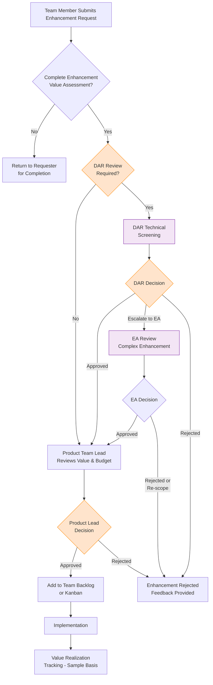
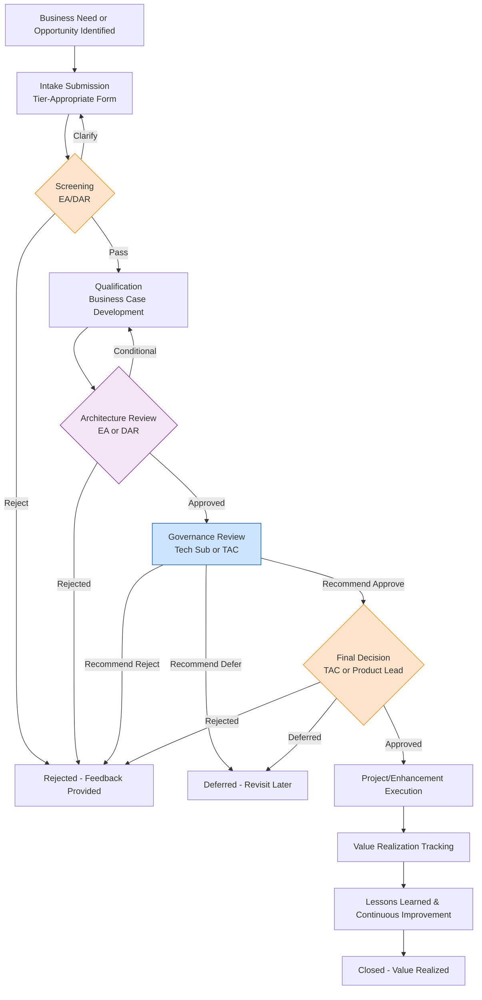
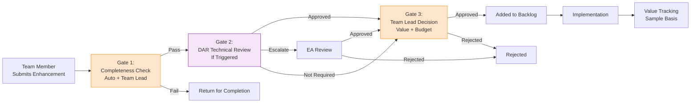
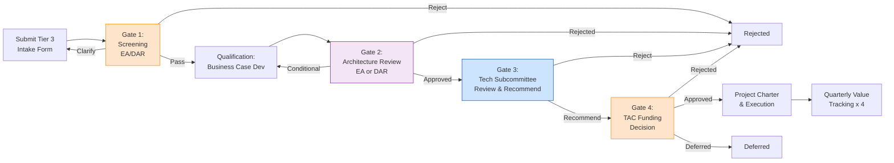
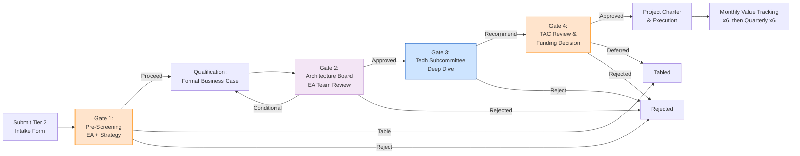
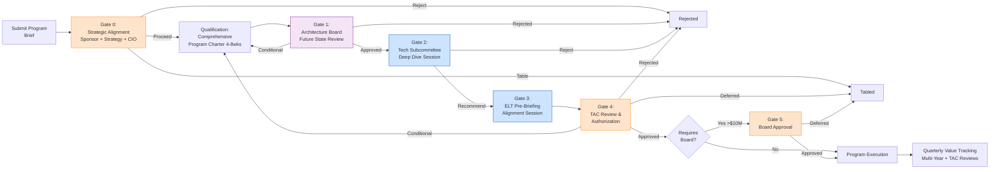
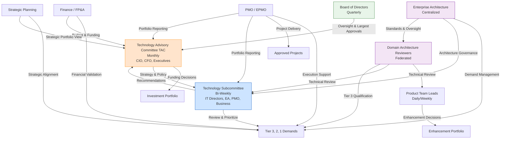

# Value-Based Demand Engagement Program
## Quantum Energy - Enabling Autonomous Small Investments & Strategic Governance

**Document Version:** 1.0
**Date:** 2025-12-22
**Scope:** Comprehensive value-based engagement framework for demand management
**Target Audience:** Technology Leadership, Business Stakeholders, Product Teams, PMO, Enterprise Architecture
**Related Documents:**
- [Federated Demand Governance Model](./federated-demand-governance-model.md)
- [Demand Workflow Visual](./demand-workflow-visual.md)

---

## Executive Summary

This program establishes a value-based engagement framework that enables Quantum Energy to make faster, smarter investment decisions across all tiers of demand. The framework balances **speed and autonomy** for small investments with **strategic rigor** for large-scale initiatives, ensuring every dollar deployed demonstrates measurable business value.

### Core Philosophy

**"Push decisions to the lowest competent level while maintaining value guardrails and strategic oversight."**

### Expected Outcomes

- **Product teams autonomously manage Enhancement-tier investments** (<$50k) within 3 days
- **Right-sized governance** applied based on investment scale and strategic impact
- **All investments demonstrate clear value** through standardized measurement criteria
- **Efficient intake and screening** processes that accelerate good ideas and filter poor fits
- **90% stakeholder satisfaction** with demand process as enabling (not bureaucratic)

### Key Differentiators

This program introduces several innovative approaches to demand management:

1. **Interview-Based Qualification (Tier 2/3):** Submitters provide lightweight, high-level intake; EA team conducts recorded interviews to collaboratively develop detailed business cases. This shifts burden from sponsors to EA experts, improves quality, and accelerates cycle time.

2. **EA-Owned Demand Value Stream:** Enterprise Architecture team manages demand from intake through governance approval. PMO takes ownership at approval for project execution. Clear handoff eliminates confusion and optimizes each team's strengths.

3. **Federated Scalability Model:** Domain Architecture Representatives (DARs) manage Tier 3 qualification in their domains; EA team handles Tier 2/1. This distributes workload while maintaining quality and standards.

4. **Cost × Complexity Matrix Tiering:** Investment tier determined by both cost AND complexity, ensuring appropriate governance for high-complexity projects regardless of dollar amount.

### Investment Tier Framework

Investment tiers are determined using a **two-dimensional matrix** that considers both **Total Project Cost** and **Project Complexity**. This ensures that high-complexity projects receive appropriate governance rigor regardless of cost, while low-complexity projects can move faster even at higher dollar values.

#### Project Tier Classification Matrix

| **Total Project Cost** | **Low Complexity** | **Medium Complexity** | **High Complexity** |
| --------------------- |---------|--------|--------|
| **Over $2M** | Tier 2 | Tier 1 | Tier 1 |
| **$500k-$2M** | Tier 3 | Tier 2 | Tier 1 |
| **$50k-$500k** | Tier 3 | Tier 3 | Tier 2 |
| **<$50k** | Enhancement | Enhancement | Enhancement* |

*High-complexity Enhancements (<$50k) may be escalated to Tier 3 at DAR/EA discretion if architectural impact is significant.

#### Tier Characteristics Summary

| Tier | Classification Criteria | Decision Authority | Cycle Time Target | Value Rigor |
|------|----------------|-------------------|------------------|-------------|
| **Enhancement** | <$50k + Low/Med complexity | Product Team Lead + DAR | 3 days | Lightweight value assessment |
| **Tier 3** | $50k-$2M + Low complexity<br>OR $50k-$500k + Medium complexity | EA/DAR + Tech Subcommittee | 7-12 days | Standard business case with ROI |
| **Tier 2** | >$2M + Low complexity<br>OR $500k-$2M + Medium complexity<br>OR $50k-$500k + High complexity | EA + Tech Subcommittee + TAC | 14-21 days | Formal business case + architecture |
| **Tier 1** | >$2M + Medium/High complexity<br>OR $500k-$2M + High complexity | EA + Executive Sponsors + TAC | 6-12 weeks | Comprehensive business case + multi-year plan |

---

## Table of Contents

1. [Value-Based Investment Framework](#1-value-based-investment-framework)
2. [Autonomous Enhancement Process](#2-autonomous-enhancement-process)
3. [Tiered Value Evaluation Process](#3-tiered-value-evaluation-process)
4. [Efficient Intake Process](#4-efficient-intake-process)
5. [Screening and Qualification Process](#5-screening-and-qualification-process)
6. [Value Measurement Framework](#6-value-measurement-framework)
7. [Gartner Prioritization Framework](#7-gartner-prioritization-framework)
8. [Process Flows and Decision Gates](#8-process-flows-and-decision-gates)
9. [Roles and Responsibilities](#9-roles-and-responsibilities)
10. [Value Governance and Oversight](#10-value-governance-and-oversight)
11. [Implementation Guidance](#11-implementation-guidance)

---

## 1. Value-Based Investment Framework

### 1.1 Core Principles

**Principle 1: Value Demonstration is Universal**
Every investment, regardless of size, must articulate its value proposition. The **depth of analysis** scales with investment size, but the **requirement to demonstrate value** does not.

**Principle 2: Speed Enables Value**
Fast decisions on small investments compound into significant value. A 3-day Enhancement approval process captures opportunities that disappear in a 30-day review cycle.

**Principle 3: Strategic Investments Deserve Strategic Rigor**
Large, complex investments receive proportional analysis, stakeholder engagement, and architectural oversight. This rigor protects the organization from costly mistakes.

**Principle 4: Transparency Builds Trust**
All value criteria, decision-making processes, and approval rationale are transparent and accessible to stakeholders.

**Principle 5: Learning Loops Drive Improvement**
Post-implementation value realization tracking creates feedback loops that improve future investment decisions.

---

### 1.2 Value Categories for Utility Context

All investments are evaluated across five value categories relevant to utility operations:

#### 1. Operational Value
- **Reliability Improvement**: Reduction in SAIDI/SAIFI, outage duration, restoration time
- **Efficiency Gains**: Labor productivity, process automation, cycle time reduction
- **Safety Enhancement**: Worker safety metrics, public safety improvements, incident reduction
- **Asset Performance**: Equipment reliability, lifespan extension, performance optimization

#### 2. Financial Value
- **Cost Avoidance**: Deferred capital, reduced O&M, avoided penalties
- **Cost Reduction**: Labor savings, material cost reduction, vendor consolidation
- **Revenue Protection**: Reduced revenue leakage, improved collections, theft reduction
- **Revenue Growth**: New service offerings, market expansion, customer acquisition (non-regulated)

#### 3. Customer Value
- **Experience Improvement**: NPS increase, satisfaction scores, effort reduction
- **Service Enhancement**: New capabilities, faster response, expanded options
- **Reliability**: Fewer outages, faster restoration, better communication
- **Affordability**: Lower bills, payment flexibility, energy efficiency enablement

#### 4. Regulatory & Compliance Value
- **Compliance Achievement**: Meeting NERC CIP, PUC mandates, environmental regulations
- **Risk Reduction**: Audit readiness, violation avoidance, penalty reduction
- **Rate Case Support**: Demonstrable investments for rate recovery, prudency documentation
- **Regulatory Relationship**: Enhanced credibility, proactive compliance, stakeholder trust

#### 5. Strategic & Capability Value
- **Strategic Alignment**: Direct support for enterprise strategic objectives
- **Capability Building**: New organizational capabilities, skill development, platform creation
- **Competitive Positioning**: Market differentiation (AES), innovation leadership
- **Option Value**: Future flexibility, scalability, platform for future initiatives

---

### 1.3 Project Complexity Definitions

Project complexity is assessed across multiple dimensions to ensure appropriate governance and architectural review. Complexity is classified as **Low**, **Medium**, or **High** based on the following criteria:

#### Low Complexity
**Characteristics:**
- **Scope:** Single system or contained business process
- **Integration:** Minimal to no integration with other systems
- **Technology:** Mature, proven technology stack; minor upgrades or incremental changes
- **Organizational Impact:** Single department or business unit
- **Change Scope:** Limited process changes; primarily technical implementation
- **Risk Profile:** Low technical risk; well-understood solution patterns
- **Architecture:** Minimal architectural impact; fits within established patterns

**Examples:**
- Single-system minor version upgrade
- Standalone reporting or analytics enhancement
- Contained workflow automation within one domain
- Dashboard or portal enhancement using existing platform

#### Medium Complexity
**Characteristics:**
- **Scope:** Multiple systems or cross-functional business processes
- **Integration:** Moderate integration requirements (2-4 systems)
- **Technology:** Mix of proven and newer technologies; significant version upgrades
- **Organizational Impact:** Multiple departments or business units
- **Change Scope:** Moderate process redesign; organizational change management required
- **Risk Profile:** Moderate technical risk; some new solution patterns
- **Architecture:** Noteworthy architectural implications; may introduce new patterns or capabilities

**Examples:**
- Enterprise application major version upgrade
- Cross-system integration initiative
- New capability implementation using established technology
- Process automation spanning multiple departments
- Data migration or consolidation project

#### High Complexity
**Characteristics:**
- **Scope:** Enterprise-wide systems or transformational business processes
- **Integration:** Extensive integration requirements (5+ systems or enterprise data fabric)
- **Technology:** Significant new technology introduction; platform replacement; architectural shift
- **Organizational Impact:** Enterprise-wide or customer-facing
- **Change Scope:** Substantial process redesign; organizational transformation
- **Risk Profile:** High technical risk; unproven solution patterns or technology
- **Architecture:** Major architectural implications; new platforms, paradigm shifts, or strategic capabilities

**Examples:**
- Core system replacement (e.g., ERP, CIS, OMS, SCADA)
- New platform introduction (e.g., customer portal, mobile platform, IoT infrastructure)
- Digital transformation initiatives
- Enterprise architecture modernization (e.g., cloud migration, microservices adoption)
- Regulatory-driven programs with enterprise impact (e.g., NERC CIP compliance)

#### Complexity Assessment During Intake

Complexity is initially self-assessed by the demand submitter using guided questions in the intake form, then validated during the **Screening** phase by EA/DAR. If complexity is re-classified during screening, the demand may be **re-tiered** accordingly.

**Complexity Escalation Triggers:**
- Integration requirements exceed initial scope
- Architectural review identifies significant technical risk
- Organizational change scope broader than anticipated
- New technology introduces unforeseen complexity

---

### 1.4 Investment Tier Definitions and Value Thresholds

Tiers are assigned based on the **Project Tier Classification Matrix** (combining Total Project Cost and Project Complexity). The following sections describe the characteristics and value thresholds for each tier.

#### Enhancement Tier
**Classification:** <$50k + Low or Medium Complexity

**Characteristics:**
- Small, incremental improvements to existing systems or processes
- Low to medium complexity, typically contained within single domain
- Minimal architectural impact
- Fast value realization (typically <6 months)
- High-complexity enhancements may be escalated to Tier 3 at DAR/EA discretion

**Value Threshold:**
- Must demonstrate positive value in at least ONE value category
- Quantified or clearly articulated benefit
- No requirement for formal ROI calculation
- Value statement sufficient (1-2 sentences)

**Examples:**
- Dashboard enhancement adding new data field
- Workflow automation reducing manual steps
- Report creation for operational visibility
- Minor UI/UX improvement based on user feedback

---

#### Tier 3
**Classification:**
- $50k-$2M + Low Complexity, OR
- $50k-$500k + Medium Complexity

**Characteristics:**
- Discrete projects with defined scope and deliverables
- Low to medium complexity; may involve multiple systems or business processes
- Some architectural considerations, particularly for medium-complexity projects
- Value realization within 12-18 months

**Value Threshold:**
- Must demonstrate positive value in TWO OR MORE value categories
- Quantified benefits with supporting assumptions
- Simple ROI calculation (payback period or NPV)
- Benefits exceed costs within 3 years

**Examples:**
- GPS tracking system implementation for fleet management
- Middleware platform upgrade
- Proof-of-concept for new technology
- Single-system replacement or modernization

---

#### Tier 2
**Classification:**
- >$2M + Low Complexity, OR
- $500k-$2M + Medium Complexity, OR
- $50k-$500k + High Complexity

**Characteristics:**
- Significant projects with enterprise impact
- Medium to high complexity with cross-domain integration and process changes
- Substantial architectural implications, particularly for high-complexity projects
- Value realization over 2-3 years

**Value Threshold:**
- Must demonstrate substantial value across MULTIPLE categories (minimum 3)
- Detailed quantified benefits with sensitivity analysis
- Full financial analysis (NPV, IRR, payback)
- Strategic value clearly articulated
- Benefits exceed costs; positive NPV over 5-year horizon

**Examples:**
- Customer portal modernization
- Operational technology system upgrade
- Enterprise data integration initiative
- Workforce management system implementation

---

#### Tier 1
**Classification:**
- >$2M + Medium or High Complexity, OR
- $500k-$2M + High Complexity

**Characteristics:**
- Transformational programs with strategic significance
- High complexity with enterprise-wide impact across multiple domains
- Complex architectural and organizational change
- Value realization over 3-5+ years

**Value Threshold:**
- Must demonstrate transformational value across ALL FIVE categories
- Comprehensive quantified benefits with scenario modeling
- Full business case with risk-adjusted NPV, sensitivity analysis, real options
- Strategic imperative clearly articulated and board-level approved
- Multi-year value realization plan with milestones
- Alignment to enterprise strategic objectives mandatory

**Examples:**
- Digital Grid Program (DGPR-001)
- Unified Customer Experience (UCE-001)
- Advanced Energy Solutions Growth Initiative (AES-G1)
- New Energy Solutions Transformation (NEST-001)

---

## 2. Autonomous Enhancement Process

### 2.1 Philosophy and Objectives

**Philosophy:** Empower product teams to move at speed on small investments that improve their products and services, while maintaining value discipline and architectural guardrails.

**Objectives:**
- Enable 3-day approval cycle for Enhancements
- Reduce EA burden on low-risk, low-complexity work
- Maintain architectural integrity through lightweight review
- Create value discipline even at small investment scale
- Build product team capability in value articulation

---

### 2.2 Enhancement Decision Authority

**Primary Decision Maker:** Product Team Lead (or equivalent functional manager)

**Decision Authority:**
- Approve/reject Enhancement requests up to $50k
- Allocate team resources and budget
- Prioritize within team backlog
- Determine implementation approach

**Decision Support:**
- Domain Architecture Reviewer (DAR) for technical screening
- Finance for budget availability verification
- PMO for demand record creation and tracking

**Escalation to EA Required If:**
- Enhancement involves new technology not in enterprise portfolio
- Cross-domain integration required (3+ systems)
- Customer-facing changes or customer data involved
- Security architecture changes needed
- Deviation from established architectural patterns
- DAR identifies complexity triggers (see federated governance model)

---

### 2.3 Enhancement Value Assessment Template

**Format:** One-page form, embedded in ServiceNow demand module

#### Section 1: Enhancement Overview
- **Enhancement Title:** [Brief, descriptive name]
- **Requesting Team/Product:** [Product name or team]
- **Business Owner:** [Name and title]
- **Estimated Cost:** [$___k]
- **Requested Delivery:** [Target date]

#### Section 2: Value Proposition (Required)
**What problem does this solve, or what opportunity does it enable?**
[2-3 sentence description]

**What value will this deliver?** (Check all that apply and provide brief quantification)
- [ ] **Operational Value:** [e.g., "Saves 10 hours/month of manual effort"]
- [ ] **Financial Value:** [e.g., "Avoids $20k annual contractor cost"]
- [ ] **Customer Value:** [e.g., "Enables customer self-service for 30% of inquiries"]
- [ ] **Regulatory/Compliance Value:** [e.g., "Improves audit readiness for PUC reporting"]
- [ ] **Strategic/Capability Value:** [e.g., "Builds reusable component for future needs"]

**Estimated Value Realization Timeframe:**
[ ] Immediate (within 30 days)
[ ] Short-term (1-6 months)
[ ] Medium-term (6-12 months)

#### Section 3: Technical Approach
**Solution Description:** [1-2 sentences on how this will be implemented]

**Systems/Platforms Involved:** [List]

**Does this require any of the following?** (Triggers DAR review)
- [ ] New technology or vendor not currently used
- [ ] Integration to systems outside this product domain
- [ ] Customer-facing changes or customer data access
- [ ] Changes to authentication, authorization, or encryption
- [ ] Cloud services or SaaS integration
- [ ] Deviation from known architectural patterns

**If any boxes checked above, DAR review is REQUIRED before Product Team Lead approval.**

#### Section 4: Approvals
- [ ] **Product Team Lead Approval:** [Name, Date]
- [ ] **DAR Technical Review** (if required): [Name, Date, Outcome]
- [ ] **Finance Budget Verification:** [Confirmed budget available Y/N]

---

### 2.4 Enhancement Decision Process Flow



**Target Cycle Time:** 3 business days from submission to Product Lead decision

---

### 2.5 Enhancement Value Tracking

**Lightweight Approach:**
- Not all Enhancements are tracked post-implementation (resource intensive)
- PMO randomly samples 10-15% of completed Enhancements quarterly
- Sample includes variety of value categories and teams
- Sampled Enhancements: Team provides brief (5-minute) update on value realized vs. expected

**Purpose of Sampling:**
- Validate that Enhancement value assessment process is credible
- Identify patterns of value over-estimation or under-estimation
- Provide feedback to teams on value articulation quality
- Demonstrate aggregate value of Enhancement portfolio to leadership

**Reporting:**
- Quarterly report: "Enhancement Portfolio Value Summary"
- Aggregate investment (~$___k), aggregate realized value, key themes
- Presented to Technology Subcommittee as evidence of governance effectiveness

---

## 3. Tiered Value Evaluation Process

### 3.1 Tier 3 Value Evaluation

**Applies to:** Projects classified as Tier 3 per the classification matrix ($50k-$2M + Low complexity, OR $50k-$500k + Medium complexity)

#### 3.1.1 Business Case Requirements

**Format:** Standardized Tier 3 Business Case Template (5-7 pages)

**Required Sections:**

**1. Executive Summary** (1 page)
- Investment overview and strategic rationale
- Total cost and funding source
- Expected value across categories
- Recommendation and decision requested

**2. Business Need and Opportunity** (1 page)
- Problem statement or opportunity description
- Current state challenges and pain points
- Consequences of not investing (cost of inaction)
- Stakeholder impact and beneficiaries

**3. Proposed Solution** (1 page)
- Solution description and scope
- Key deliverables and capabilities
- Implementation approach and timeline
- Technology/vendor overview

**4. Value Quantification** (2 pages)
- **Value Category Analysis:** Quantified benefits in each applicable category
  - Operational Value: [Specific metrics and quantification]
  - Financial Value: [Cost reduction, cost avoidance, revenue impact]
  - Customer Value: [Experience metrics, satisfaction impact]
  - Regulatory/Compliance Value: [Risk reduction, compliance achievement]
  - Strategic/Capability Value: [Capability building, strategic alignment]

- **Financial Analysis:**
  - Total Cost of Ownership (5-year): Capital + Operating costs
  - Total Benefits (5-year): Quantified value across categories
  - Simple ROI: Payback period in years
  - Net Present Value (NPV) calculation (10% discount rate standard)
  - Sensitivity analysis: Best case / Base case / Worst case

**5. Risks and Mitigation** (1 page)
- Key risks (technical, organizational, financial, schedule)
- Mitigation strategies for high/medium risks
- Dependencies on other initiatives or systems

**6. Implementation Plan** (1 page)
- High-level timeline and milestones
- Resource requirements (internal FTEs, contractors, vendors)
- Governance and decision-making structure
- Success criteria and value realization plan

---

#### 3.1.2 Tier 3 Value Evaluation Criteria

**All criteria must be met for approval recommendation:**

| Criterion | Threshold | Evaluation Method |
|-----------|-----------|-------------------|
| **Value Demonstration** | Positive value in 2+ categories | Business case review |
| **Financial Viability** | Positive NPV over 5 years | Financial analysis |
| **Strategic Alignment** | Supports at least one strategic objective | Strategy mapping |
| **Architectural Fit** | Complies with standards OR approved exception | EA/DAR review |
| **Feasibility** | Resources available, timeline realistic | PMO assessment |
| **Risk Acceptable** | No high risks without mitigation | Risk review |
| **Regulatory Prudent** | Defensible in rate case (if regulated) | Finance/Regulatory review |

**Decision Matrix:**

| Rating | Definition | Recommendation |
|--------|------------|----------------|
| **Strong Value** | Exceeds all criteria; NPV >$100k; strategic imperative | Approve - High Priority |
| **Good Value** | Meets all criteria; positive NPV; clear benefits | Approve - Standard Priority |
| **Marginal Value** | Barely meets criteria; low NPV; limited benefits | Conditional Approve or Defer |
| **Insufficient Value** | Fails one or more criteria | Reject or Return for Revision |

---

#### 3.1.3 Tier 3 Decision Gates

**Gate 1: Screening (EA/DAR)**
- **Purpose:** Verify demand is complete, correctly tiered, not duplicate, architecturally feasible
- **Outcome:** Proceed to Qualification / Reject / Return for Revision
- **Target:** 1-2 days

**Gate 2: Qualification (Business Owner + EA/DAR)**
- **Purpose:** Develop business case demonstrating value and feasibility
- **Deliverable:** Completed Tier 3 Business Case
- **Outcome:** Business case ready for governance review
- **Target:** 5-7 days

**Gate 3: Architecture Review (EA Team or DAR)**
- **Purpose:** Validate technical approach, standards compliance, integration strategy
- **Outcome:** Architecture Approved / Approved with Conditions / Rejected
- **Target:** 3-5 days (concurrent with business case development)

**Gate 4: Technology Subcommittee Review**
- **Purpose:** Portfolio prioritization, resource allocation, recommendation to TAC
- **Outcome:** Recommend Approve / Recommend Defer / Recommend Reject
- **Target:** Bi-weekly meeting cycle

**Gate 5: TAC Funding Decision**
- **Purpose:** Final go/no-go decision and funding authorization
- **Outcome:** Approved / Deferred / Rejected
- **Presentation:** Tier 3 items typically on consent agenda unless flagged
- **Target:** Monthly meeting cycle

**Total Tier 3 Cycle Time Target:** 7-12 days (standard vs. escalated complexity)

---

### 3.2 Tier 2 Value Evaluation

**Applies to:** Projects classified as Tier 2 per the classification matrix (>$2M + Low complexity, OR $500k-$2M + Medium complexity, OR $50k-$500k + High complexity)

#### 3.2.1 Business Case Requirements

**Format:** Formal Business Case Template (15-20 pages + appendices)

**Required Sections:** (All Tier 3 requirements PLUS the following)

**Enhanced Value Quantification:**
- Detailed 5-year financial model with annual breakdown
- Sensitivity analysis across multiple variables
- Risk-adjusted NPV calculation
- Comparison to alternative solutions considered
- Benefit realization timeline with milestones

**Organizational Change Management:**
- Stakeholder analysis and engagement plan
- Training and capability building requirements
- Process change implications
- Communication strategy

**Detailed Implementation Plan:**
- Project governance structure (steering committee, sponsor, PM)
- Resource plan (FTEs by role, contractors, vendors)
- Detailed schedule with critical path analysis
- Procurement strategy and vendor management approach

**Value Realization Plan:**
- Specific metrics for each value category with baseline and targets
- Measurement methodology and data sources
- Quarterly value tracking and reporting plan
- Accountability for benefits realization (named owners)

---

#### 3.2.2 Tier 2 Value Evaluation Criteria

**All criteria must be met at HIGHER standard than Tier 3:**

| Criterion | Threshold | Evaluation Method |
|-----------|-----------|-------------------|
| **Value Demonstration** | Substantial value in 3+ categories | Business case review by EA + Finance |
| **Financial Viability** | NPV >$250k over 5 years; IRR >12% | Detailed financial modeling |
| **Strategic Alignment** | Directly enables strategic objective(s) | Strategy office review |
| **Architectural Integrity** | Full architectural review; integration strategy | EA formal review and presentation |
| **Feasibility** | Detailed project plan; resources committed | PMO detailed assessment |
| **Risk Management** | Comprehensive risk register; mitigation plans | Risk committee review |
| **Stakeholder Support** | Executive sponsor committed; stakeholders aligned | Sponsor interview |
| **Regulatory Support** | Regulatory Affairs approval (if applicable) | Regulatory team review |

**Decision Matrix:**

| Rating | Definition | Recommendation |
|--------|------------|----------------|
| **Strategic Imperative** | Transformational value; strategic necessity; strong NPV | Approve - Prioritize |
| **High Value** | Exceeds all criteria significantly | Approve - Fund Fully |
| **Acceptable Value** | Meets all criteria; positive case | Approve - Standard Funding |
| **Questionable Value** | Marginal on some criteria | Conditional / Phase / Defer |
| **Insufficient Value** | Fails criteria | Reject or Fundamentally Re-scope |

---

#### 3.2.3 Tier 2 Decision Gates

**Gate 1: Pre-Screening (EA + Strategic Planning)**
- **Purpose:** Validate strategic fit before significant business case investment
- **Outcome:** Proceed / Defer / Redirect
- **Target:** 2-3 days

**Gate 2: Qualification (Business Owner + EA + Finance)**
- **Purpose:** Develop comprehensive business case
- **Deliverable:** Formal Tier 2 Business Case
- **Target:** 10-14 days

**Gate 3: Architecture Board Review (EA Team)**
- **Purpose:** Formal architectural assessment and recommendation
- **Deliverable:** Architecture Review Report
- **Outcome:** Approve / Approve with Conditions / Reject
- **Target:** 5-7 days

**Gate 4: Technology Subcommittee Review**
- **Purpose:** Detailed review, Q&A, portfolio fit, resource feasibility
- **Presentation:** Business sponsor presents full business case
- **Outcome:** Recommend Approve / Recommend with Modifications / Recommend Reject
- **Target:** Bi-weekly meeting (with potential for deep-dive session)

**Gate 5: TAC Review and Funding Decision**
- **Purpose:** Executive decision on funding and priority
- **Presentation:** Sponsor + EA present; Q&A with executive team
- **Outcome:** Approved / Approved with Conditions / Deferred / Rejected
- **Target:** Monthly meeting cycle

**Total Tier 2 Cycle Time Target:** 14-21 days from submission to TAC decision

---

### 3.3 Tier 1 Value Evaluation

**Applies to:** Programs classified as Tier 1 per the classification matrix (>$2M + Medium/High complexity, OR $500k-$2M + High complexity)

#### 3.3.1 Business Case Requirements

**Format:** Comprehensive Program Charter and Business Case (30-50 pages + extensive appendices)

**Required Components:** (All Tier 2 requirements PLUS the following)

**1. Strategic Context and Imperative** (5 pages)
- Alignment to enterprise strategy with detailed mapping
- Competitive/market analysis (where applicable)
- Regulatory drivers and stakeholder expectations
- Long-term vision and transformation roadmap

**2. Multi-Year Financial Model** (5-7 pages)
- 7-10 year financial projection with annual detail
- Capital and operating expenditure breakdown by year
- Benefit quantification by year and by category
- Multiple NPV scenarios (risk-adjusted, optimistic, pessimistic)
- IRR, payback period, benefit-cost ratio
- Funding strategy and cash flow implications

**3. Future State Architecture** (5-7 pages)
- Target state architecture diagrams
- Integration landscape and data flows
- Technology platform strategy
- Migration and transition architecture
- Comparison to current state with gap analysis

**4. Organizational Transformation Plan** (5 pages)
- Organizational design changes
- Capability building and workforce development
- Change management strategy and readiness assessment
- Cultural change requirements
- Stakeholder engagement and communication plan

**5. Program Governance and Delivery** (5 pages)
- Program governance structure (board, steering committee, working groups)
- Stage-gate delivery approach with decision points
- Resource plan (program team, workstreams, external partners)
- Vendor strategy and procurement approach
- Quality assurance and risk management framework

**6. Value Realization and Benefits Management** (5-7 pages)
- Comprehensive value realization plan by category
- Baseline metrics and target state metrics with measurement approach
- Quarterly benefits tracking methodology
- Accountability model (benefit owners, tracking owners)
- Course-correction triggers and governance

---

#### 3.3.2 Tier 1 Value Evaluation Criteria

**Must demonstrate TRANSFORMATIONAL VALUE:**

| Criterion | Threshold | Evaluation Method |
|-----------|-----------|-------------------|
| **Strategic Imperative** | Directly enables 3+ strategic objectives; board-level priority | Strategy + Board review |
| **Transformational Value** | Significant value across ALL FIVE categories | Comprehensive analysis |
| **Financial Return** | NPV >$5M over 7 years; IRR >15%; Strong BCR | Detailed financial modeling + sensitivity |
| **Architectural Foundation** | Creates enterprise platform/capability for future | EA strategic assessment |
| **Enterprise Impact** | Cross-domain transformation; organizational change | Impact assessment |
| **Risk Managed** | Comprehensive risk management; executive oversight | Risk committee + Board |
| **Stakeholder Alignment** | Executive sponsors committed; key stakeholders aligned | Sponsor engagement + surveys |
| **Regulatory Positioned** | Regulatory strategy clear; rate recovery path (if applicable) | Regulatory Affairs assessment |
| **Delivery Confidence** | Experienced program leadership; proven delivery approach | PMO + Executive assessment |

**Decision Matrix:**

| Rating | Definition | Action |
|--------|------------|--------|
| **Mission Critical** | Essential to strategy; existential risk if not done | Approve - Top Priority - Secure Resources |
| **Transformational** | Exceeds all criteria; game-changing value | Approve - Prioritize - Fund Fully |
| **Strong Strategic Value** | Meets all criteria; clear transformation | Approve - Fund as Planned |
| **Acceptable with Conditions** | Meets most criteria; some concerns | Conditional Approval - Address Conditions |
| **High Risk / Uncertain Value** | Marginal criteria; significant risks | Defer - Pilot First - Re-evaluate |
| **Insufficient Case** | Fails multiple criteria | Reject or Fundamentally Re-conceive |

---

#### 3.3.3 Tier 1 Decision Gates

**Gate 0: Strategic Alignment (Executive Sponsor + Strategy Office)**
- **Purpose:** Validate strategic fit and executive sponsorship BEFORE business case investment
- **Deliverable:** Program Brief (10 pages) with strategic rationale
- **Outcome:** Proceed to Full Business Case / Table for Future / Reject
- **Target:** 5-7 days

**Gate 1: Business Case Development (Program Team + EA + Finance + Strategy)**
- **Purpose:** Develop comprehensive program charter and business case
- **Deliverable:** Full Tier 1 Program Charter and Business Case
- **Target:** 4-8 weeks (depending on complexity)

**Gate 2: Architecture Board Review (EA Team + CTO/CIO)**
- **Purpose:** Formal architectural assessment; future state validation
- **Deliverable:** Future State Architecture Report and Recommendation
- **Outcome:** Approve / Approve with Conditions / Reject
- **Target:** 7-10 days

**Gate 3: Technology Subcommittee Deep Dive**
- **Purpose:** Detailed technical and business review; portfolio fit; resource feasibility
- **Format:** Extended session (2-3 hours) with business sponsor, program lead, EA, finance
- **Outcome:** Recommend Approve / Recommend with Modifications / Recommend Reject
- **Target:** Scheduled as special session (bi-weekly cycle)

**Gate 4: Executive Leadership Team (ELT) Pre-Briefing**
- **Purpose:** Socialize program with executive team before formal TAC
- **Format:** Working session to address executive questions and concerns
- **Outcome:** Refinement of business case; alignment on approach
- **Target:** 1-2 weeks before TAC

**Gate 5: TAC Review and Funding Authorization**
- **Purpose:** Final executive decision on program authorization and funding
- **Format:** Formal presentation (60-90 min) with sponsor, program director, EA, CFO
- **Outcome:** Authorized / Authorized with Conditions / Deferred / Rejected
- **Target:** Monthly or quarterly TAC meeting (depending on TAC cadence)

**Gate 6: Board Review (for programs >$10M or strategic significance)**
- **Purpose:** Board awareness and approval for largest investments
- **Format:** Executive summary + presentation to Board or Board committee
- **Outcome:** Board approval secured
- **Target:** Quarterly Board meeting

**Total Tier 1 Cycle Time Target:** 6-12 weeks from strategic alignment to funding authorization (depending on program scale and Board involvement)

---

## 4. Efficient Intake Process

### 4.1 Intake Philosophy

**Principle:** Make it easy to submit good ideas; make it clear what's needed; reduce rework through upfront clarity.

**Design Goals:**
- Single point of entry for all demand (ServiceNow portal or equivalent)
- Tier-appropriate intake forms (don't ask for Tier 1 detail on Enhancement)
- Contextual help and examples embedded in forms
- Auto-routing based on investment size and type
- Immediate confirmation and transparency on next steps

---

### 4.2 Unified Intake Portal

**Tool:** ServiceNow Demand Management Module (or equivalent IT Service Management platform)

**Features:**
- **Single Portal:** One entry point for all demand regardless of tier
- **Intelligent Form:** Dynamic form that adapts based on initial questions
- **Guided Intake:** Contextual help, examples, and tooltips throughout
- **Attachment Support:** Ability to upload supporting documents
- **Auto-Save:** Draft capability so requesters can complete over time
- **Status Tracking:** Requesters can see where their demand is in the process
- **Notification:** Automated alerts at each stage transition

---

### 4.3 Intake Form Design (Intelligent, Tiered)

**Step 1: Initial Classification (All Requesters)**

**Question 1: What type of work is this?**
- [ ] Break-Fix or Incident (Route to Incident Management process - outside demand workflow)
- [ ] Enhancement to existing system/process (<$50k expected)
- [ ] Project or Initiative ($50k+ expected)
- [ ] Not sure (Trigger intake consultation with EA)

**Question 2: What is the estimated total investment?** (For Enhancement or Project)
- [ ] Less than $50k
- [ ] $50k - $500k
- [ ] $500k - $2M
- [ ] Greater than $2M
- [ ] Unknown

**Question 3: What is the estimated project complexity?** [? Help tooltip with complexity definitions]
- [ ] **Low** - Single system, minimal integration, proven technology, single department
- [ ] **Medium** - Multiple systems, moderate integration (2-4 systems), cross-functional
- [ ] **High** - Enterprise-wide, extensive integration (5+ systems), new technology, transformational
- [ ] **Unsure** - Request PMO assistance

**Based on Questions 2 and 3, the system automatically routes to the appropriate form using the Project Tier Classification Matrix:**
- Enhancement Form: <$50k + Low/Medium complexity
- Tier 3 Form: As per matrix (e.g., $50k-$2M + Low, or $50k-$500k + Medium)
- Tier 2 Form: As per matrix (e.g., >$2M + Low, or $500k-$2M + Medium, or $50k-$500k + High)
- Tier 1 Form: As per matrix (e.g., >$2M + Medium/High, or $500k-$2M + High)
- If "Unsure" on complexity: Default to one tier higher for safety; re-tiered during screening

**Question 4: Requester Information**
- Name:
- Title:
- Department/Business Unit:
- Email:
- Phone:

**Step 2: Tier-Specific Intake Forms**

Based on answers to Step 1, requester is presented with appropriate intake form:

---

#### 4.3.1 Enhancement Intake Form

**Format:** Single-page web form (5 minutes to complete)

**1. Enhancement Title:** [Brief, descriptive]

**2. What problem are you solving or opportunity are you enabling?** [2-3 sentences]

**3. What is the proposed solution?** [2-3 sentences]

**4. What value will this deliver?** [Select all that apply and briefly quantify]
- [ ] Operational Value: [e.g., saves 10 hrs/month]
- [ ] Financial Value: [e.g., avoids $20k/year cost]
- [ ] Customer Value: [e.g., improves satisfaction for X customer segment]
- [ ] Regulatory/Compliance Value: [e.g., meets requirement Y]
- [ ] Strategic/Capability Value: [e.g., enables future capability Z]

**5. Estimated Cost:** $___k

**6. Which product/system does this affect?** [Dropdown list]

**7. Target Delivery Date:** [Date picker]

**8. Attachments:** [Optional: mockups, requirements, supporting docs]

**Submit Button:** Creates demand record in ServiceNow; auto-routes to Product Team Lead + DAR (if technical review required)

---

#### 4.3.2 Tier 3 Project Intake Form (High-Level Submission)

**Philosophy:** Tier 3 intake is intentionally lightweight. Submitters provide high-level information to trigger an **EA-facilitated intake interview** where details are collaboratively developed.

**Format:** Single-page web form (5-10 minutes to complete)

**Section 1: Project Overview**
- **Project Title:** [Clear, descriptive name]
- **Business Sponsor:** [Name, Title, Department]
- **Contact Information:** [Email, Phone]
- **Strategic Objective Alignment:** [Dropdown of enterprise strategic objectives]
- **Estimated Total Investment:** $___k [Rough order of magnitude]
- **Estimated Complexity:** [Pre-filled from intake Question 3; Low/Medium/High]

**Section 2: Business Need (High-Level)**
- **What problem are you solving or opportunity are you enabling?** [3-5 sentences]
- **Who will benefit?** [Customers / Operations / Regulatory / Internal Teams - select all that apply]
- **What happens if we don't do this?** [1-2 sentences on consequences]

**Section 3: Proposed Approach (High-Level)**
- **Solution Overview:** [2-3 sentences describing the proposed approach]
- **Systems/Platforms Likely Involved:** [Free text or multi-select]
- **Desired Timeline:** [Target start / Target completion]

**Section 4: Expected Value (High-Level)**
Select all value categories you expect this project to deliver:
- [ ] **Operational Value** - Briefly describe: ___________
- [ ] **Financial Value** - Rough estimate: $___k/year
- [ ] **Customer Value** - Briefly describe: ___________
- [ ] **Regulatory/Compliance Value** - Briefly describe: ___________
- [ ] **Strategic/Capability Value** - Briefly describe: ___________

**Section 5: Supporting Information**
- **Attachments:** [Optional: rough estimates, vendor quotes, diagrams, reference materials]
- **Additional Context:** [Anything else we should know?]

**What Happens Next:**
Upon submission, the EA team will:
1. **Screen** your submission (1-2 business days)
2. **Schedule an intake interview** (30-45 minutes) with you and key stakeholders
3. **Record the interview** and develop detailed demand documentation
4. **Update the demand record** with interview insights for governance review

**Submit Button:** Creates Tier 3 demand record; auto-routes to EA for screening and interview scheduling

---

#### 4.3.3 Tier 2 Project Intake Form (High-Level Submission)

**Philosophy:** Tier 2 intake mirrors the Tier 3 approach with an **EA-facilitated intake interview**, but with deeper strategic exploration given the higher investment and complexity.

**Format:** Single-page web form (5-10 minutes to complete)

**Sections:** Same as Tier 3 High-Level Submission Form (Sections 1-5)

**Additional Tier 2-Specific Questions:**

**Section 6: Strategic and Organizational Context**
- **Why is this strategically important?** [2-3 sentences]
- **Which departments/functions will be impacted?** [Free text or multi-select]
- **Is this a regulatory mandate or strategic choice?** [Mandate / Strategic / Both]
- **Do you have executive sponsorship?** [Yes - Name: _____ / Seeking sponsor / Unsure]

**Section 7: Supporting Information**
- **Attachments:** [Optional: rough estimates, vendor quotes, diagrams, reference materials]
- **Additional Context:** [Anything else we should know?]

**What Happens Next:**
Upon submission, the EA team will:
1. **Screen** your submission with Strategic Planning Office (2-3 business days)
2. **Schedule an intake interview** (60 minutes) with you, executive sponsor, and key stakeholders
3. **Record the interview** and develop comprehensive demand documentation
4. **Update the demand record** with interview insights and develop formal business case outline
5. **Route to governance** for review and funding decision

**Submit Button:** Creates Tier 2 demand record; auto-routes to EA + Strategic Planning for screening and interview scheduling

---

#### 4.3.4 Tier 1 Program Intake Form (Program Brief)

**Format:** Structured template guiding requester to create 10-page Program Brief

**Program Brief Sections:**
1. **Executive Summary** (1 page)
2. **Strategic Context and Imperative** (2 pages)
3. **Business Need and Opportunity** (2 pages)
4. **Proposed Program Approach** (2 pages)
5. **Expected Value and Benefits** (2 pages)
6. **High-Level Cost Estimate and Funding** (1 page)
7. **Risks and Dependencies** (1 page)
8. **Next Steps and Decision Requested** (1 page)

**Guidance:** Tier 1 intake is NOT a web form. Requester downloads Program Brief template, completes with support from Strategy Office, and submits as formal document.

**Submit Process:** Email submission to dedicated Tier 1 intake mailbox; EA/Strategy Office creates demand record and initiates Gate 0 review.

---

### 4.4 Intake Support and Enablement

**Challenge:** Requesters may not know what tier, or how to articulate value, or what's needed.

**Solution: Intake Support Services**

#### 4.4.1 Self-Service Resources

**Intake Resource Center** (SharePoint or Confluence site)

**Contents:**
- **Intake FAQs:** Common questions answered
- **Tier Selection Guide:** Interactive matrix tool to determine correct tier based on cost and complexity
- **Complexity Assessment Guide:** Detailed guide with examples to help assess project complexity (Low/Medium/High)
- **Example Submissions:** Anonymized examples of good intake forms for each tier
- **Value Quantification Guide:** How to estimate and articulate value
- **Cost Estimation Guidance:** Templates for rough order of magnitude estimates
- **Video Tutorials:** Short videos walking through intake process and complexity assessment
- **Templates and Tools:** Excel templates for cost/benefit estimation, complexity self-assessment checklist

---

#### 4.4.2 Assisted Intake (For Tier 2 and Tier 1)

**EA Intake Consultation Service**

**What:** 30-60 minute consultation with EA team member to help requester prepare intake submission

**When Available:**
- Tier 2: Optional but encouraged (improves quality and reduces rework)
- Tier 1: Mandatory before Program Brief submission

**Consultation Topics:**
- Tiering validation (is this really Tier 2, or could it be Tier 3?)
- Complexity assessment guidance
- Value articulation guidance
- Architectural considerations and feasibility
- Identification of stakeholders and dependencies
- Intake form walkthrough

**How to Request:** Self-service scheduling link; EA team assigns consultant based on domain and expertise

---

#### 4.4.3 Strategic Planning Office Partnership (Tier 1 Only)

**What:** Strategy Office partners with Tier 1 sponsors to develop Program Brief

**Process:**
1. Sponsor requests Tier 1 intake consultation
2. Strategy Office assigns strategist to partner with sponsor
3. Joint development of Program Brief over 2-4 weeks
4. Strategy Office ensures strategic alignment and executive positioning
5. Formal submission when brief is strong

**Benefit:** Higher quality Tier 1 submissions; better strategic alignment; fewer rejections

---

### 4.5 Intake Quality Gates

**Automated Validation (Built into ServiceNow)**

**All Tiers:**
- [ ] All required fields completed
- [ ] Requester contact information valid
- [ ] At least one value category selected and quantified
- [ ] Cost estimate provided
- [ ] Funding source identified

**Tier 3+:**
- [ ] Business sponsor identified and valid
- [ ] Strategic objective alignment selected
- [ ] All value categories addressed (even if "not applicable")
- [ ] Risk section completed

**If validation fails:** Intake form cannot be submitted; requester receives clear error messages on what's missing

---

**Manual Screening (EA team - first business day after submission)**

**Screening Checklist:**
- [ ] Is this the right tier? (Re-tier if necessary)
- [ ] Is this a duplicate of existing demand or project?
- [ ] Is the request clear and understandable?
- [ ] Is the value articulation reasonable (not obviously inflated or unsupported)?
- [ ] Are there obvious red flags (e.g., cost estimate wildly unrealistic)?

**Screening Outcomes:**
- **Accept:** Proceed to next stage (qualification or architecture review)
- **Clarify:** Return to requester with specific questions (24-hour turnaround expected)
- **Re-tier:** Move to correct tier and notify requester
- **Redirect:** This is operational issue, not demand (route to appropriate process)
- **Reject:** Does not meet threshold (feedback provided; can be re-submitted)

**Target:** Screening complete within 1-2 business days of submission

---

## 5. Screening and Qualification Process

### 5.1 Screening Philosophy

**Purpose:** Protect downstream governance from poor-quality demands while not becoming a bottleneck

**Principles:**
- **Fast:** Screening complete in 1-2 days maximum
- **Helpful:** If demand is incomplete or unclear, provide specific guidance to requester
- **Consistent:** Apply same screening criteria regardless of who submitted or political pressure
- **Transparent:** Screening criteria and outcomes visible to all stakeholders
- **Enabling:** Goal is to improve quality, not to be gatekeepers

---

### 5.2 Screening Criteria by Tier

#### 5.2.1 Enhancement Screening (Product Team Lead or PMO)

| Criterion | Pass | Clarify | Fail |
|-----------|------|---------|------|
| **Completeness** | All required fields filled | 1-2 fields missing | Multiple fields missing |
| **Value Articulated** | At least one value category quantified | Value described but not quantified | No value articulation |
| **Cost Estimate** | Reasonable estimate provided | Estimate seems high/low | No estimate or wildly unrealistic |
| **Scope Clarity** | Clear what's being requested | Somewhat vague but understandable | Unclear or contradictory |
| **Tier Appropriate** | <$50k + Low/Med complexity per matrix | Borderline complexity (could escalate to Tier 3) | Wrong tier per matrix (re-tier) |
| **Complexity Validation** | Complexity rating matches scope description | Complexity may be understated | Clearly wrong complexity (escalate) |

**Screening Time:** Same day or next business day

**Screener:** Product Team Lead (for their team's requests) or EA team (if centralized intake)

**Common Rejection Reasons:**
- This is a break-fix issue, not an enhancement (route to incident management)
- Duplicate of existing request
- Not actually a technical enhancement (business process issue, HR issue, etc.)

---

#### 5.2.2 Tier 3 Screening (EA/DAR)

| Criterion | Pass | Clarify | Fail |
|-----------|------|---------|------|
| **Completeness** | All intake sections complete | 1-2 sections need more detail | Multiple sections incomplete |
| **Business Need** | Clear problem or opportunity | Need is described but vague | No clear business need |
| **Value Quantification** | 2+ value categories with estimates | Value categories identified but not quantified | Minimal or no value articulation |
| **Cost Estimate** | ROM estimate with basis | Estimate provided but no basis | No estimate or unrealistic |
| **Tier Appropriate** | Cost + complexity align with Tier 3 matrix | Borderline tier (could be Enhancement or Tier 2) | Wrong tier per matrix (re-tier) |
| **Complexity Validation** | Complexity justified by scope, integration, tech | Complexity may need adjustment | Clearly wrong complexity (re-tier) |
| **Architectural Feasibility** | No obvious architectural red flags | Some architectural questions | Architecturally infeasible or conflicts |
| **Duplicate Check** | Not duplicate | Similar to existing but distinct | Duplicate (consolidate) |
| **Funding Source** | Identified and feasible | Identified but unclear if available | No funding source |

**Screening Time:** 1-2 business days

**Screener:** EA/DAR (business need, value, complexity, and architectural screening)

**Screening Meeting:** EA/DAR conducts 15-minute review of each new Tier 3 submission (daily or every other day depending on volume)

**Common Rejection Reasons:**
- Duplicate of existing project
- No clear value proposition
- Architecturally conflicts with enterprise direction
- Funding not available or inappropriate funding source
- Business need not substantiated

---

#### 5.2.3 Tier 2 Screening (EA + Strategic Planning)

| Criterion | Pass | Clarify | Fail |
|-----------|------|---------|------|
| **Strategic Alignment** | Clearly supports strategic objective(s) | Alignment claimed but not obvious | No strategic alignment |
| **Business Need** | Compelling case with urgency | Need described but not urgent | Weak or unclear need |
| **Value Quantification** | 3+ value categories with estimates | Value claimed but not quantified | Insufficient value articulation |
| **Cost Estimate** | Detailed ROM with assumptions | High-level estimate | No estimate or unrealistic |
| **Tier Appropriate** | Cost + complexity align with Tier 2 matrix | Borderline tier | Wrong tier per matrix (re-tier) |
| **Complexity Validation** | Complexity justified and manageable | Complexity needs further validation | Complexity underestimated (re-tier or reject) |
| **Sponsor Commitment** | Executive sponsor identified and committed | Sponsor identified but commitment unclear | No sponsor or sponsor not appropriate level |
| **Resource Feasibility** | Resources potentially available | Resource needs high but may be feasible | Resources clearly not available |

**Screening Time:** 2-3 business days

**Screener:** EA + Strategic Planning Office (joint review)

**Screening Process:**
1. **Individual Review:** Each party (EA, Strategy) reviews submission independently (Day 1)
2. **Screening Meeting:** 30-minute joint meeting to discuss (Day 2)
3. **Decision and Feedback:** Consensus decision; feedback to requester if clarification or rejection (Day 2-3)

**Pre-Screening Consultation Offered:** For Tier 2, offer 30-min consultation BEFORE formal submission to improve quality

---

#### 5.2.4 Tier 1 Screening (Gate 0: Strategic Alignment)

**Process:** Not a quick screening; this is Gate 0 formal review

**Reviewers:** Strategic Planning Office + CIO/CTO + Relevant Executive Sponsor(s)

**Inputs:** Program Brief (10 pages)

**Evaluation Criteria:**

| Criterion | Strong | Acceptable | Weak |
|-----------|--------|------------|------|
| **Strategic Imperative** | Mission-critical; board priority | Supports strategy clearly | Tangential to strategy |
| **Executive Sponsorship** | ELT sponsor fully committed | Sponsor identified and supportive | Sponsor unclear or uncommitted |
| **Tier Appropriate** | Cost + complexity clearly warrant Tier 1 | Borderline (could be Tier 2) | Should be Tier 2 (re-tier) |
| **Complexity Assessment** | High complexity clearly justified | Medium/high complexity | Complexity overstated (re-tier) |
| **Timing and Urgency** | Right time; urgent need | Good timing; moderate urgency | Premature or can wait |
| **Feasibility** | High confidence in deliverability | Feasible but challenging | High risk or infeasible |
| **Investment Readiness** | Ready for full business case development | Some gaps but can proceed | Not ready; more work needed |

**Gate 0 Decision:**
- **Proceed to Full Business Case:** Sponsor authorized to invest in comprehensive business case development (4-8 weeks effort)
- **Table for Future Consideration:** Good idea but wrong timing; revisit in 6-12 months
- **Reject or Fundamentally Re-scope:** Does not meet strategic threshold

**Screening Time:** 5-7 business days (includes executive briefing and decision)

---

### 5.3 Qualification Process

**Purpose:** Transform screened demand into governance-ready business case

**Qualification = Business Case Development**

#### 5.3.1 Enhancement Qualification

**Qualification Step:** Product Team Lead reviews value and budget

**Activities:**
1. Verify budget availability in team allocation
2. Assess value proposition (does it make sense?)
3. Prioritize against other team backlog items
4. Decide: Approve / Defer / Reject

**Time:** 1-2 days

**Output:** Decision (approved items added to backlog/Kanban)

---

#### 5.3.2 Tier 3 Qualification (Interview-Based Process)

**Qualification Owner:** EA team (with Business Sponsor participation)

**Process Overview:**
The EA team facilitates qualification through a structured interview process, then develops the business case documentation from the interview recording and collaboration with the sponsor.

**Phase 1: Interview Scheduling and Preparation (Days 1-2)**

**Activities:**
1. **Schedule Interview:** EA team schedules 30-45 minute interview session
2. **Identify Participants:** Business Sponsor + key SMEs + EA/DAR + PMO (optional)
3. **Prepare Interview Guide:** EA team customizes interview questions based on initial submission
4. **Pre-read Materials:** Participants review initial submission and any attachments

**Participant Preparation:** Sponsors are sent interview prep guide with questions to consider

---

**Phase 2: Intake Interview (Day 3-5)**

**Interview Facilitator:** Assigned EA team member (or DAR for domain-specific demands)

**Interview Format:** 30-45 minute recorded session (Teams/Zoom with transcription enabled)

**Interview Agenda:**
1. **Introduction** (5 min) - Purpose, process, and outcomes
2. **Business Need Deep Dive** (10 min)
   - What problem are we solving? For whom?
   - What's the current state pain? What's driving this now?
   - What happens if we don't do this?
3. **Solution Approach** (10 min)
   - What's the proposed solution? Alternatives considered?
   - What systems/platforms are involved?
   - What are the key deliverables?
4. **Value Exploration** (10 min)
   - What value will this deliver? (explore all 5 categories)
   - How will we measure success?
   - What's the rough financial impact?
5. **Complexity and Feasibility** (5 min)
   - Architectural implications? Integration needs?
   - Resource requirements? Timeline expectations?
   - Key risks or constraints?
6. **Next Steps** (5 min) - Timeline, documentation, governance process

**Recording:** Session recorded and auto-transcribed via Teams/Zoom

---

**Phase 3: Documentation Development (Days 6-7)**

**Activities Led by EA Team:**
1. **Review Recording and Transcript:** EA team member reviews interview
2. **Develop Business Case:** EA team drafts Tier 3 Business Case (5-7 pages) using template
   - Incorporates interview insights
   - Adds architectural analysis
   - Develops rough financial model (with Finance support if needed)
3. **Complexity Validation:** EA/DAR validates tier classification based on interview
4. **Draft Review with Sponsor:** EA shares draft with sponsor for validation (async or 15-min review call)
5. **Finalize Documentation:** EA team incorporates sponsor feedback

**EA Team Time Investment:** 3-4 hours per Tier 3 demand (interview prep, facilitation, documentation)

**Output:** Qualified Tier 3 Business Case ready for Technology Subcommittee

**Updated Demand Record:** All details captured in ServiceNow demand record

---

**Phase 4: Quality Gate and Routing (Day 7)**

**Quality Check:** EA team lead reviews for completeness before routing to governance

**Routing:** EA team submits to Technology Subcommittee agenda

**Total Cycle Time:** 7-10 business days from submission to governance-ready

---

#### 5.3.3 Tier 2 Qualification (Interview-Based Process)

**Qualification Owner:** EA team (with Business Sponsor and Strategic Planning participation)

**Process Overview:**
The EA team facilitates qualification through a comprehensive interview process, then develops the formal business case documentation in collaboration with the sponsor, PMO, and Finance.

**Phase 1: Interview Scheduling and Preparation (Days 1-3)**

**Activities:**
1. **Schedule Interview:** EA team schedules 60-minute interview session
2. **Identify Participants:** Business Sponsor + Executive Sponsor + key SMEs + EA + Strategic Planning + Finance (optional) + PMO (optional)
3. **Prepare Interview Guide:** EA team customizes detailed interview questions based on initial submission and strategic context
4. **Pre-read Materials:** Participants review initial submission, relevant strategic plans, and any supporting documents
5. **Coordinate Support Resources:** EA coordinates with EPMO for business analyst support (if needed); Finance assigns FP&A analyst (if financial modeling needed)

**Participant Preparation:** Sponsors receive detailed prep guide with strategic and financial questions

---

**Phase 2: Intake Interview (Days 4-6)**

**Interview Facilitator:** Senior EA team member + Strategic Planning representative

**Interview Format:** 60-minute recorded session (Teams/Zoom with transcription enabled)

**Interview Agenda:**
1. **Introduction** (5 min) - Purpose, process, and outcomes
2. **Strategic Context** (15 min)
   - How does this enable our strategic objectives?
   - Why is this the right time? What's the urgency?
   - What's the competitive/regulatory driver?
   - How does executive sponsorship work?
3. **Business Need and Current State** (10 min)
   - Detailed problem/opportunity exploration
   - Current state pain points and quantification
   - Impact of not proceeding (risk of inaction)
4. **Solution Approach and Architecture** (15 min)
   - Proposed solution in detail; alternatives considered
   - Systems/platforms involved; integration requirements
   - Technology approach; vendor considerations
   - Architectural implications and complexity
5. **Value and Benefits** (10 min)
   - Value across all 5 categories (detailed quantification)
   - How will we measure success? Benefit realization plan
   - Financial impact modeling (revenue, cost, capital)
6. **Organizational and Change Impact** (5 min)
   - Departments/functions impacted
   - Process changes required
   - Change management and training needs
7. **Risks, Resources, Timeline** (5 min)
   - Key risks and mitigation strategies
   - Resource requirements (people, budget, vendors)
   - Timeline expectations and critical dependencies
8. **Next Steps** (5 min) - Documentation process, timeline, governance

**Recording:** Session recorded and auto-transcribed via Teams/Zoom

---

**Phase 3: Collaborative Documentation Development (Days 7-12)**

**Activities Led by EA Team (with support from PMO and Finance):**

1. **Review Recording and Transcript** (Day 7)
   - EA team member reviews interview thoroughly
   - Identifies areas needing clarification or additional detail

2. **Develop Formal Business Case** (Days 7-10)
   - **EA team** drafts Tier 2 Business Case (15-20 pages) using template
   - **EA team** coordinates with EPMO for project planning and resource estimate support (if needed)
   - **Finance analyst** builds financial model (NPV, IRR, payback, sensitivity analysis)
   - **EA architect** performs architecture review and creates architecture assessment
   - All sections incorporate interview insights and add professional analysis

3. **Complexity and Tier Validation** (Day 8)
   - EA validates tier classification based on interview
   - Re-tier if needed and notify sponsor

4. **Stakeholder Validation** (Days 9-10)
   - EA coordinates with sponsor to validate key assumptions
   - Finance validates financial model with sponsor and budget owners
   - EA validates resource and timeline feasibility (with EPMO input if needed)

5. **Draft Review with Sponsor** (Day 11)
   - EA shares complete draft with sponsor for review
   - 30-minute review meeting to discuss and refine

6. **Finalize Documentation** (Day 12)
   - EA team incorporates sponsor feedback
   - EA, Finance, and Strategic Planning perform quality review
   - Final business case and architecture review report completed

**EA Team Time Investment:** 8-12 hours per Tier 2 demand (interview prep, facilitation, documentation, coordination)

**EPMO Support (if requested):** 4-6 hours (project planning support, resource analysis)

**Finance Time Investment:** 3-5 hours (financial modeling, validation)

**Output:** Formal Tier 2 Business Case + Architecture Review Report + Financial Model

**Updated Demand Record:** All details captured in ServiceNow demand record

---

**Phase 4: Quality Gate and Routing (Day 13-14)**

**Quality Review:** Multi-party review (EA lead, PMO, Finance) ensures completeness and quality

**Strategic Alignment Check:** Strategic Planning validates strategic fit

**Routing:** EA team submits to Technology Subcommittee and TAC agenda

**Total Cycle Time:** 14-16 business days from submission to governance-ready

---

#### 5.3.4 Tier 1 Qualification

**Qualification Owner:** Program Director (hired or assigned to lead business case development)

**Activities:**
1. **Establish Program Office:** Program Director + core team (strategy, architecture, finance, PMO)
2. **Develop Comprehensive Program Charter:** 30-50 page document
3. **Detailed Financial Modeling:** Multi-year, multi-scenario financial analysis with Finance
4. **Future State Architecture:** EA team develops target state architecture and migration plan
5. **Organizational Transformation Planning:** Change management, capability building, workforce strategy
6. **Stakeholder Engagement:** Extensive socialization with all affected executives and stakeholders
7. **Risk and Benefits Management Plan:** Comprehensive frameworks for ongoing program
8. **Executive Socialization:** Pre-brief ELT members individually before formal governance

**Time:** 4-8 weeks (depends on program scope and complexity)

**Support Available:**
- Strategy Office partnership (mandatory)
- Dedicated EA architect(s)
- Finance program accounting support
- PMO program management methodology and tools
- External consultants if needed (for specialized expertise)

**Output:** Comprehensive Program Charter + Future State Architecture + Executive Alignment

**Quality Gate:** Strategy Office + CFO + CIO/CTO review before TAC submission

---

### 5.4 Screening and Qualification Metrics

**Operational Metrics:**

| Metric | Target | Purpose |
|--------|--------|---------|
| **Screening Cycle Time** | Enhancement: 1 day; Tier 3: 2 days; Tier 2: 3 days | Measure speed |
| **Screening Pass Rate** | 70-80% (first submission) | Measure intake quality |
| **Clarification Rate** | 15-20% | Acceptable level of back-and-forth |
| **Rejection Rate** | 5-10% | Balance quality without being overly restrictive |
| **Re-tiering Rate** | 10-15% | Measure if intake guidance is effective |
| **Qualification Cycle Time** | Tier 3: 7 days; Tier 2: 14 days; Tier 1: 6 weeks | Measure efficiency |
| **Qualification Rework** | <10% returned for major revision | Measure qualification quality |

**Quality Metrics:**

| Metric | Target | Purpose |
|--------|--------|---------|
| **Governance Approval Rate** | 80-90% of qualified demands approved | Validate screening/qualification effectiveness |
| **Stakeholder Satisfaction** | >4.0/5.0 with intake process | Measure experience |
| **Value Realization Accuracy** | Actual vs. planned value within 20% | Validate value quantification quality |

---

## 6. Value Measurement Framework

### 6.1 Value Measurement Philosophy

**Principle:** What gets measured gets managed. Systematic value tracking drives better investment decisions and organizational accountability.

**Measurement Approach:**
- **Baseline Measurement:** Establish current state metrics BEFORE investment
- **Target Setting:** Define specific, measurable targets for each value category
- **Periodic Tracking:** Measure progress quarterly (Tier 2/1) or sample basis (Enhancement/Tier 3)
- **Accountability:** Assign benefit owners responsible for realizing value
- **Course Correction:** Use variance from plan to trigger corrective actions
- **Learning:** Feed lessons from value realization back into future business cases

---

### 6.2 Value Measurement by Category

#### 6.2.1 Operational Value Metrics

**Reliability Improvement:**
- SAIDI (System Average Interruption Duration Index) - minutes
- SAIFI (System Average Interruption Frequency Index) - count
- CAIDI (Customer Average Interruption Duration Index) - minutes
- Outage restoration time - hours
- Planned vs. unplanned outage ratio

**Efficiency Gains:**
- Process cycle time - hours or days
- Labor hours per unit of work - hours/transaction
- Automation rate - % of transactions automated
- First-time-right rate - % without rework
- Throughput - units processed per period

**Safety Enhancement:**
- OSHA recordable incident rate - incidents per 200k hours
- Lost-time injury frequency - injuries per million hours
- Near-miss reporting rate - reports per thousand employees
- Safety observation completion rate - %
- Public safety incidents - count

**Asset Performance:**
- Asset availability - % uptime
- Mean time between failures (MTBF) - hours
- Mean time to repair (MTTR) - hours
- Asset utilization rate - %
- Equipment remaining useful life - years

---

#### 6.2.2 Financial Value Metrics

**Cost Avoidance:**
- Deferred capital expenditure - $
- Avoided contractor/consulting costs - $
- Prevented regulatory penalties - $
- Avoided system failures/downtime costs - $

**Cost Reduction:**
- Annual O&M reduction - $ per year
- Labor cost reduction - FTE equivalents or $
- Material/supply cost reduction - $
- Vendor consolidation savings - $

**Revenue Protection:**
- Reduced unbilled energy - MWh or Mcf
- Improved collections rate - %
- Theft/diversion reduction - $ recovered
- Revenue leakage closure - $

**Revenue Growth (primarily Non-Regulated):**
- New customer acquisition - count and $
- New service revenue - $ per year
- Market share gain - %
- ARPU (Average Revenue Per User) increase - $

---

#### 6.2.3 Customer Value Metrics

**Experience Improvement:**
- Net Promoter Score (NPS) - score (-100 to +100)
- Customer Satisfaction Score (CSAT) - score (1-5 or 1-10)
- Customer Effort Score (CES) - score (1-5)
- Customer complaint rate - complaints per 1,000 customers
- Call center: First call resolution rate - %

**Service Enhancement:**
- Self-service adoption rate - % transactions
- Digital channel usage - % customers using digital
- Service availability - % uptime (customer portals, etc.)
- Service response time - hours or days
- Service options available - count

**Reliability (Customer Perspective):**
- Customer outage frequency - per customer per year
- Customer outage duration - minutes per customer per year
- Notification effectiveness - % customers notified before/during outage
- Restoration communication timeliness - minutes

**Affordability:**
- Average customer bill - $ per month
- Customer participation in efficiency programs - count
- Payment arrangement utilization - %
- Disconnection for non-payment rate - %

---

#### 6.2.4 Regulatory & Compliance Value Metrics

**Compliance Achievement:**
- Compliance audit findings - count (goal: zero)
- Regulatory requirement fulfillment - % complete
- Violation frequency - count (goal: zero)
- Time to compliance from new regulation - days

**Risk Reduction:**
- Audit readiness - % documentation complete
- Compliance control effectiveness - % controls passing test
- Time to produce regulatory reports - hours or days
- Regulatory inspection pass rate - %

**Rate Case Support:**
- Approved rate recovery - % of requested
- Prudency determination - approved/denied
- Rate case preparation time - hours
- Evidence quality score - rating

**Regulatory Relationship:**
- Regulator satisfaction with utility - score (survey-based)
- Frequency of regulator inquiries - count
- Stakeholder testimony support - favorable/neutral/opposed
- Regulatory reputation - qualitative assessment

---

#### 6.2.5 Strategic & Capability Value Metrics

**Strategic Alignment:**
- Strategic objectives supported - count
- Strategic initiative enablement - count of initiatives enabled
- Board/ELT priority alignment - high/medium/low
- Competitive positioning - market rank or qualitative

**Capability Building:**
- New capabilities delivered - count
- Capability maturity improvement - level increase
- Employee skill development - certifications or proficiencies gained
- Process maturity - CMMI level or equivalent

**Competitive Positioning (Non-Regulated):**
- Market share - %
- Competitive win rate - %
- Brand perception - score or rank
- Innovation leadership - industry recognition

**Option Value:**
- Future initiatives enabled - count
- Platform scalability - capacity for future growth
- Technology flexibility - ability to adapt to change
- Reuse potential - # of future projects leveraging this

---

### 6.3 Value Realization Tracking Process

#### 6.3.1 Enhancement Value Tracking

**Approach:** Sample-based (10-15% of completed Enhancements quarterly)

**Process:**
1. **Sample Selection:** PMO randomly selects Enhancements across teams and value categories
2. **Value Check-In:** PMO schedules 15-minute call with product team
3. **Questions Asked:**
   - Did you complete this Enhancement?
   - What value did you expect? (Refresh from original submission)
   - What value did you actually realize?
   - Any lessons learned?
4. **Documentation:** Brief summary captured in demand record
5. **Aggregate Reporting:** Quarterly summary of Enhancement portfolio value

**Benefit:** Lightweight approach that validates Enhancement value framework without bureaucratic burden

---

#### 6.3.2 Tier 3 Value Tracking

**Approach:** All Tier 3 projects tracked; reporting quarterly

**Process:**
1. **Baseline Measurement:** At project kickoff, project manager confirms baseline metrics
2. **Target Confirmation:** Validate value targets from business case
3. **Quarterly Reporting:** Project manager reports value metrics quarterly during project
4. **Post-Implementation Tracking:** Quarterly tracking for 1 year post-go-live
5. **Value Realization Report:** Final report at 12 months post-implementation comparing actual vs. planned

**Accountability:**
- **Project Manager:** Responsible for tracking during project
- **Benefit Owner:** Business leader accountable for realizing value post-implementation
- **PMO:** Facilitates tracking and reporting

**Governance Touchpoint:** Quarterly value report included in PMO portfolio report to Technology Subcommittee

---

#### 6.3.3 Tier 2 Value Tracking

**Approach:** Rigorous tracking with executive visibility

**Process:**
1. **Value Realization Plan:** Developed during qualification; part of business case
2. **Baseline Measurement:** Formal baseline data collection before project start
3. **Benefits Owner Assignment:** Named business leader accountable for each benefit
4. **Monthly Tracking During Project:** Project steering committee reviews value metrics
5. **Post-Implementation Tracking:** Monthly for first 6 months; quarterly for next 18 months (total 2 years)
6. **Executive Review:** Semi-annual value realization review with executive sponsor

**Deliverables:**
- **Value Realization Dashboard:** Real-time dashboard showing value metrics vs. targets
- **Variance Reports:** When actual significantly differs from plan, benefit owner produces variance analysis and corrective action plan
- **Annual Value Report:** Comprehensive report on value realized vs. business case

**Governance Touchpoint:** Semi-annual deep dive with Technology Subcommittee on all Tier 2 projects' value realization

---

#### 6.3.4 Tier 1 Value Tracking

**Approach:** Comprehensive benefits management with board visibility

**Process:**
1. **Benefits Management Framework:** Formal framework established as part of program governance
2. **Benefits Register:** Comprehensive register of all benefits with owners, metrics, baselines, targets
3. **Baseline Data Collection:** Extensive data collection across all value categories before program start
4. **Quarterly Benefits Review:** Program steering committee reviews all benefit metrics
5. **Executive Sponsor Accountability:** Executive sponsor personally accountable to TAC/Board for value realization
6. **Multi-Year Tracking:** Quarterly tracking for life of program + 2-3 years post-completion
7. **Annual Board Reporting:** Program value realization report to Board annually

**Deliverables:**
- **Benefits Realization Dashboard:** Executive dashboard with real-time value metrics
- **Benefits Realization Reports:** Quarterly comprehensive reports to TAC
- **Annual Value Assessment:** External validation of value realized (for largest programs)
- **Lessons Learned Repository:** Extensive documentation for future program benefit

**Governance Touchpoint:**
- Quarterly: TAC reviews benefit realization as standing agenda item
- Annually: Board receives program value assessment
- Program gates: Value achievement vs. plan is gate criterion for continued funding

---

### 6.4 Value Realization Governance

#### Benefit Owner Accountability Model

**Benefit Owner Role:**
- Business leader (not project/program manager) accountable for realizing specific benefits
- Named in business case with explicit accountability
- Responsible for taking business actions necessary to realize value (e.g., process changes, adoption, capability use)
- Reports on benefit metrics according to tracking schedule

**Benefit Owner Responsibilities:**
- Validate benefit is achievable and measurement approach is feasible
- Collect baseline data before project
- Take actions post-implementation to realize benefit (not automatic)
- Report on benefit metrics according to schedule
- Produce variance analysis if benefit not realized
- Implement corrective actions to close value gaps

**Example:**
- **Project:** Customer portal modernization (Tier 2)
- **Benefit:** Reduce call center volume by 20% through self-service deflection
- **Benefit Owner:** VP Customer Service
- **Accountability:** VP Customer Service must promote portal adoption, train CSRs to direct customers to portal, measure call deflection, report quarterly, and take corrective action if call volume doesn't decline

---

#### Value Realization Reporting Cadence

| Tier | During Project | Post-Implementation | Executive Review | Board Reporting |
|------|---------------|---------------------|------------------|-----------------|
| **Enhancement** | None (sample only) | Sample basis | Quarterly aggregate | Annual portfolio summary |
| **Tier 3** | Quarterly | Quarterly x 4 (1 year) | Semi-annual | Annual portfolio summary |
| **Tier 2** | Monthly (steering) | Monthly x 6, then quarterly x 6 (2 years) | Semi-annual deep dive | Annual portfolio summary |
| **Tier 1** | Monthly (program board) | Quarterly for duration + 2-3 years | Quarterly TAC standing item | Annual comprehensive report |

---

#### Course Correction Triggers

**When actual value significantly differs from plan, governance intervenes:**

**Variance Thresholds Triggering Review:**
- **Tier 3:** >30% variance from planned value at 1-year post-implementation
- **Tier 2:** >20% variance from planned value at any quarterly review
- **Tier 1:** >15% variance from planned value at any quarterly review

**Course Correction Process:**
1. **Benefit Owner Analysis:** Benefit owner produces root cause analysis of variance
2. **Corrective Action Plan:** Benefit owner proposes actions to close gap (or revise target if assumptions changed)
3. **Governance Review:** Technology Subcommittee (Tier 2/3) or TAC (Tier 1) reviews and approves corrective action plan
4. **Implementation:** Benefit owner implements corrective actions
5. **Follow-up:** Next period reporting includes progress on corrective actions

**Escalation:** If variance persists for 2+ consecutive periods, escalate to TAC for executive intervention

---

### 6.5 Value Measurement Tools and Templates

#### 6.5.1 Value Realization Plan Template (Tier 2 and Tier 1)

**Section 1: Value Summary**

| Value Category | Baseline | Target (Year 1) | Target (Year 3) | Measurement Metric | Data Source |
|----------------|----------|-----------------|-----------------|-------------------|-------------|
| Operational | [Current state] | [Y1 target] | [Y3 target] | [Specific metric] | [System/report] |
| Financial | [Current state] | [Y1 target] | [Y3 target] | [Specific metric] | [System/report] |
| Customer | [Current state] | [Y1 target] | [Y3 target] | [Specific metric] | [System/report] |
| Regulatory | [Current state] | [Y1 target] | [Y3 target] | [Specific metric] | [System/report] |
| Strategic | [Current state] | [Y1 target] | [Y3 target] | [Specific metric] | [System/report] |

**Section 2: Benefits Register**

| Benefit ID | Benefit Description | Benefit Category | Benefit Owner | Baseline | Target | Metric | Data Source | Realization Timeline |
|------------|-------------------|------------------|---------------|----------|--------|--------|-------------|---------------------|
| B-001 | [Description] | [Category] | [Name, Title] | [Value] | [Value] | [Metric] | [Source] | [Q1 2026, etc.] |
| ... | ... | ... | ... | ... | ... | ... | ... | ... |

**Section 3: Measurement Methodology**

For each benefit:
- **Data Collection Method:** How will this metric be measured?
- **Frequency:** How often will it be measured?
- **Responsibility:** Who collects the data?
- **Reporting:** How is it reported to governance?

**Section 4: Value Realization Roadmap**

[Gantt chart or timeline showing when each benefit is expected to be realized]

---

#### 6.5.2 Quarterly Value Realization Report Template

**Project/Program:** [Name]
**Tier:** [1/2/3]
**Reporting Period:** [Q__ 202_]
**Report Date:** [Date]
**Prepared By:** [Name]

**Executive Summary:** [1-paragraph summary of value realized this quarter]

**Value Scorecard:**

| Value Category | Target This Quarter | Actual This Quarter | Variance | Status | Comments |
|----------------|-------------------|-------------------|----------|--------|----------|
| Operational | [Target] | [Actual] | [+/- %] | [Green/Yellow/Red] | [Brief explanation] |
| Financial | [Target] | [Actual] | [+/- %] | [Green/Yellow/Red] | [Brief explanation] |
| Customer | [Target] | [Actual] | [+/- %] | [Green/Yellow/Red] | [Brief explanation] |
| Regulatory | [Target] | [Actual] | [+/- %] | [Green/Yellow/Red] | [Brief explanation] |
| Strategic | [Target] | [Actual] | [+/- %] | [Green/Yellow/Red] | [Brief explanation] |

**Status Key:**
- Green: On track or exceeding target
- Yellow: 10-20% variance; corrective action planned
- Red: >20% variance; immediate attention required

**Detailed Benefit Performance:**

[For each benefit in register, provide brief update]

**Issues and Risks to Value Realization:**

[List any issues or risks that may impact value]

**Corrective Actions (if any):**

[Describe any corrective actions taken or planned]

**Next Quarter Focus:**

[What actions will be taken next quarter to realize value?]

**Attachments:**
- Supporting data and analysis
- Benefit owner sign-offs

---

## 7. Gartner Prioritization Framework

### 7.1 Philosophy and Purpose

**Core Philosophy:** All investments are categorized to ensure alignment with strategic objectives and operational necessities. This framework, inspired by Gartner's model, provides a clear, qualitative approach to portfolio management, ensuring that resources are allocated to the most appropriate areas based on their contribution to the enterprise.

**Purpose:**
- To categorize investments into clear, understandable buckets that reflect their strategic intent.
- To facilitate portfolio balancing across different types of investment (e.g., mandatory vs. growth).
- To provide a common language for discussing and debating the merits of different initiatives.
- To ensure that non-discretionary work is clearly identified and managed, while discretionary investments are aligned with strategic goals.

---

### 7.2 Prioritization Categories

All initiatives are classified into one of four categories. This classification determines the funding approach, governance path, and portfolio treatment.

#### Category 1: Mandatory

**Description:** Investments required to comply with government regulations, industry standards, or legal mandates. This category also includes investments that are critical to business continuity, security, or financial reporting, where failure to invest would result in significant loss of income, legal penalties, or existential risk.

**Sub-categories:**
- **Compliance:** Fulfilling legal or regulatory requirements (e.g., NERC CIP, PUC orders, environmental standards).
- **Security:** Addressing critical security vulnerabilities or threats.
- **Criticality:** Preventing imminent failure of a mission-critical system or process; addressing significant delays in financial reporting.

**Portfolio Treatment:**
- **Funding:** Non-discretionary. These initiatives are funded first, before any discretionary investments are considered.
- **Governance:** Fast-tracked through governance for approval and execution. The focus is on *how* to deliver, not *if*.
- **Justification:** Justification is based on the mandate or critical business need, not on traditional ROI. The cost of *inaction* is the primary driver.

---

#### Category 2: Priority Development

**Description:** Discretionary investments focused on building the future business capabilities that will deliver a competitive advantage. These initiatives are about creating new value, entering new markets, or fundamentally changing how the business operates.

**Sub-categories:**
- **Transformation:** Creating new business models or fundamentally altering the enterprise's value proposition.
- **Core Differentiation:** Building unique capabilities that allow the business to stand out in the market.
- **Growth:** Expanding the business within the current business model (e.g., new products, new markets).

**Portfolio Treatment:**
- **Funding:** Discretionary, allocated from a strategic investment fund or portfolio. Competes with other Priority Development initiatives.
- **Governance:** Subject to rigorous business case evaluation, including strategic alignment, market analysis, and financial modeling (NPV, IRR).
- **Justification:** Based on long-term value creation, strategic fit, and potential for significant return on investment.

---

#### Category 3: Improvement

**Description:** Discretionary investments aimed at optimizing existing business processes, systems, and resources. The focus is on doing things better, faster, and cheaper.

**Sub-categories:**
- **Operational Efficiency:** Reducing personnel costs, increasing productivity, or streamlining workflows.
- **Capital Efficiency:** Reducing the need for hardware/software resources, leveraging economies of scale, or improving asset utilization.

**Portfolio Treatment:**
- **Funding:** Discretionary, often funded from an operational budget or a continuous improvement fund. Competes with other Improvement initiatives.
- **Governance:** Requires a solid business case with a clear and defensible ROI calculation (e.g., payback period, cost-benefit analysis).
- **Justification:** Based on measurable improvements in efficiency, cost reduction, or productivity.

---

#### Category 4: Maintenance

**Description:** Investments required to maintain the basic service level of IT systems and applications. This includes routine bug fixes, software upgrades, and hardware refreshes.

**Sub-categories:**
- **Bug Fixes:** Correcting defects in existing software.
- **Software Upgrades:** Applying patches, updates, or minor version upgrades to stay current and supported.
- **Hardware Refresh:** Replacing aging infrastructure to maintain performance and reliability.

**Portfolio Treatment:**
- **Funding:** Typically funded from a dedicated IT maintenance budget ("Keep the Lights On").
- **Governance:** Lightweight governance. Approval is often managed by the IT department or product teams within their allocated budgets.
- **Justification:** Based on the need to maintain system health, security, and supportability. Justification is often technical rather than business-focused.

---

### 7.3 Portfolio Allocation and Balancing

Instead of a numerical score, the Gartner framework uses the categories to guide portfolio allocation and balancing.

**Portfolio Balancing Process:**

**Step 1: Categorize All Demand**
All active demand (Enhancements through Tier 1) is assigned to one of the four categories during the intake and qualification process.

**Step 2: Allocate Budgets by Category**
Leadership allocates budget envelopes to each category based on strategic priorities for the planning period (e.g., Annual Operating Plan). A typical allocation might be:
- **Mandatory:** As required (unconstrained)
- **Maintenance:** 15-20% of IT budget
- **Improvement:** 30-40% of discretionary budget
- **Priority Development:** 50-60% of discretionary budget

**Step 3: Prioritize Within Categories**
Within each category, initiatives are prioritized based on relevant criteria:
- **Mandatory:** Prioritized by deadline or criticality. A regulatory deadline in 3 months is higher priority than one in 12 months.
- **Priority Development:** Prioritized based on strategic alignment, potential ROI, and market impact.
- **Improvement:** Prioritized based on ROI, payback period, or efficiency gain.
- **Maintenance:** Prioritized based on technical risk, end-of-life dates, or impact on system stability.

**Step 4: Apply Capacity and Make Decisions**
- **Mandatory & Maintenance:** Fund all initiatives until the budget for that category is exhausted.
- **Priority Development & Improvement:** Fund the highest-priority initiatives within each category until the budget for that category is exhausted. Initiatives "below the line" are deferred or rejected.

**Step 5: Executive Review**
The Technology Advisory Committee (TAC) reviews the categorized portfolio and the allocation decisions. The TAC has the authority to:
- Adjust budget allocations between categories based on shifting strategic priorities.
- Challenge the categorization of specific initiatives.
- Make final trade-off decisions for initiatives near the "funding line."

---

### 7.4 Integration with Demand Intake

**Integration with Intake Process:**

All demand intake forms (Enhancement through Tier 1) are updated to include a **Prioritization Category** section:

1.  **Select a Primary Category:**
    *   [ ] **Mandatory**
    *   [ ] **Priority Development**
    *   [ ] **Improvement**
    *   [ ] **Maintenance**

2.  **Select a Sub-category:** (Options appear based on the primary category selected)

3.  **Justification:** (Narrative field)
    *   Provide a brief explanation for why this initiative belongs in the selected category.
    *   For **Mandatory**, cite the specific regulation, security risk, or critical need.
    *   For **Priority Development**, link to strategic objectives.
    *   For **Improvement**, provide the expected efficiency or cost savings.
    *   For **Maintenance**, describe the technical need.

**Screening Impact:**
During the EA/DAR screening, the selected category is reviewed and validated.
- The category informs the level of rigor required for the business case.
- It sets expectations with the submitter about how their initiative will be evaluated and funded.
- It allows for early portfolio analysis and alignment with budget envelopes.

---

### 7.5 Governance Integration

**Enhancement Tier:**
- Most Enhancements will fall into the **Improvement** or **Maintenance** categories.
- The Product Team Lead prioritizes their backlog based on a mix of quick wins (Improvement) and essential fixes (Maintenance).

**Tier 3:**
- Tier 3 projects are typically in the **Improvement** or **Maintenance** categories.
- The Technology Subcommittee reviews these initiatives and prioritizes them based on ROI or technical need against the allocated budget for that category.

**Tier 2:**
- Tier 2 projects are often in the **Priority Development** or **Improvement** categories.
- The TAC reviews these initiatives, ensuring they align with the strategic goals for that category and fit within the allocated budget.

**Tier 1:**
- Tier 1 programs are almost exclusively in the **Priority Development** or **Mandatory** categories.
- These are reviewed by the TAC and the Board with a focus on strategic impact and long-term value creation.

---

### 7.6 Prioritization Example

**Scenario:** Three Tier 3 initiatives competing for limited discretionary budget:

| Initiative | Cost | Category | Justification |
|------------|------|----------|---------------|
| **A: Fleet GPS Tracking** | $150k | Improvement | "Reduce fuel costs by 10% and overtime by 5% through route optimization and better tracking. Expected payback in 18 months." |
| **B: NERC CIP Compliance Audit Tool** | $250k | Mandatory | "Required to meet NERC CIP v6 audit requirements by Q3. Failure to comply will result in significant fines." |
| **C: Customer Portal V2 - Mobile App** | $400k | Priority Development | "Create a new mobile app to improve customer engagement (target 20% increase in digital interaction) and differentiate our service from competitors."|

**Analysis:**

**Initiative B (NERC CIP Compliance):**
- **Category:** Mandatory
- **Portfolio Treatment:** Funded from the non-discretionary "Mandatory" budget. This initiative is not in competition with A and C for discretionary funds. It will be funded and fast-tracked.

**Initiative C (Customer Portal V2):**
- **Category:** Priority Development
- **Portfolio Treatment:** Competes for the "Priority Development" budget. It will be evaluated against other strategic initiatives based on its potential to increase customer engagement and provide a competitive advantage.

**Initiative A (Fleet GPS Tracking):**
- **Category:** Improvement
- **Portfolio Treatment:** Competes for the "Improvement" budget. It will be evaluated against other improvement projects based on its 18-month payback period and expected cost savings.

**Decision:**
- Initiative B is funded automatically from the Mandatory budget.
- The TAC will then decide how to allocate the remaining discretionary budget between the "Priority Development" and "Improvement" categories.
- Initiative C will be ranked against other "Priority Development" projects.
- Initiative A will be ranked against other "Improvement" projects.

---

### 7.7 Tools and Templates

**Prioritization Assessor:**
- Embedded in all ServiceNow demand intake forms.
- Guides the user in selecting the appropriate category and sub-category.
- Provides examples and criteria for each category.
- The output is the selected category and justification, not a numerical score.

**Portfolio Dashboard:**
- Real-time view of the portfolio, segmented by the four Gartner categories.
- Shows the allocated budget vs. requested/funded amount for each category.
- Allows leadership to visualize the portfolio balance (e.g., % of spend on Mandatory vs. Growth).
- Initiatives are ranked within their category based on the relevant prioritization criteria.

**Quarterly Portfolio Report Template:**
- Summarizes the portfolio by Gartner category.
- Tracks spending against the budget for each category.
- Highlights key decisions and trade-offs made within each category.
---

## 8. Process Flows and Decision Gates

### 8.1 End-to-End Process Flow (All Tiers)



---

### 8.2 Enhancement Process Flow with Decision Gates



**Gate 1: Completeness Check**
- **Decision Maker:** Auto-validation + Team Lead
- **Criteria:** All required fields complete; value articulated
- **Cycle Time:** Same day
- **Outcome:** Proceed / Return for Completion

**Gate 2: DAR Technical Review** (if triggered)
- **Decision Maker:** Domain Architecture Reviewer
- **Criteria:** Technical feasibility; standards compliance; no complexity triggers
- **Cycle Time:** 1 day
- **Outcome:** Approved / Escalate to EA / Rejected

**Gate 3: Team Lead Decision**
- **Decision Maker:** Product Team Lead
- **Criteria:** Value proposition acceptable; budget available; priority vs. other work
- **Cycle Time:** 1-2 days
- **Outcome:** Approved / Rejected

**Total Enhancement Cycle Time:** 3 days target

---

### 8.3 Tier 3 Process Flow with Decision Gates



**Gate 1: Screening**
- **Decision Maker:** EA/DAR
- **Criteria:** Complete submission; clear business need; value articulated; architecturally feasible; correct tier; not duplicate
- **Cycle Time:** 1-2 days
- **Outcome:** Proceed to Qualification / Clarify / Reject

**Gate 2: Architecture Review**
- **Decision Maker:** EA Team (complex) or DAR (standard)
- **Criteria:** Standards compliance; integration strategy sound; technology appropriate; technical debt managed
- **Cycle Time:** 3-5 days (may be concurrent with business case)
- **Outcome:** Approved / Approved with Conditions / Rejected

**Gate 3: Technology Subcommittee Review**
- **Decision Maker:** Technology Subcommittee (cross-functional leadership)
- **Criteria:** Value demonstrated; business case sound; portfolio fit; resources available; risk acceptable
- **Cycle Time:** Bi-weekly meeting cycle
- **Outcome:** Recommend Approve / Recommend Defer / Recommend Reject

**Gate 4: TAC Funding Decision**
- **Decision Maker:** Technology Advisory Committee (executive governance)
- **Criteria:** Technology Subcommittee recommendation; strategic alignment; funding available
- **Cycle Time:** Monthly meeting (Tier 3 typically consent agenda)
- **Outcome:** Approved / Deferred / Rejected

**Total Tier 3 Cycle Time:** 7-12 days (standard vs. escalated complexity)

---

### 8.4 Tier 2 Process Flow with Decision Gates



**Gate 1: Pre-Screening**
- **Decision Maker:** EA + Strategic Planning
- **Criteria:** Strategic alignment; executive sponsor committed; right timing; feasible; ready for business case investment
- **Cycle Time:** 2-3 days
- **Outcome:** Proceed / Table for Future / Reject

**Gate 2: Architecture Board Review**
- **Decision Maker:** EA Team (formal review)
- **Criteria:** Comprehensive architecture assessment; future state viable; integration strategy sound; enterprise alignment
- **Deliverable:** Architecture Review Report
- **Cycle Time:** 5-7 days
- **Outcome:** Approved / Approved with Conditions / Rejected

**Gate 3: Technology Subcommittee Deep Dive**
- **Decision Maker:** Technology Subcommittee
- **Format:** Extended session (1-2 hours) with sponsor presentation and Q&A
- **Criteria:** Value substantial; business case rigorous; architecture approved; portfolio fit; resources committed
- **Cycle Time:** Bi-weekly meeting (scheduled as deep dive)
- **Outcome:** Recommend Approve / Recommend with Modifications / Recommend Reject

**Gate 4: TAC Review and Funding Decision**
- **Decision Maker:** TAC (executive committee)
- **Format:** Sponsor + EA presentation with executive Q&A
- **Criteria:** Technology Subcommittee recommendation; strategic priority; funding available; executive confidence
- **Cycle Time:** Monthly TAC meeting
- **Outcome:** Approved / Approved with Conditions / Deferred / Rejected

**Total Tier 2 Cycle Time:** 14-21 days from submission to TAC decision

---

### 8.5 Tier 1 Process Flow with Decision Gates



**Gate 0: Strategic Alignment**
- **Decision Maker:** Executive Sponsor + Strategy Office + CIO/CTO
- **Input:** Program Brief (10 pages)
- **Criteria:** Strategic imperative; executive sponsorship; right timing; investment readiness
- **Cycle Time:** 5-7 days
- **Outcome:** Proceed to Full Business Case / Table / Reject

**Gate 1: Architecture Board Review**
- **Decision Maker:** EA Team + CTO/CIO
- **Input:** Future State Architecture Report
- **Criteria:** Target architecture viable; migration plan sound; enterprise platform value; long-term sustainability
- **Cycle Time:** 7-10 days
- **Outcome:** Approved / Approved with Conditions / Rejected

**Gate 2: Technology Subcommittee Deep Dive**
- **Decision Maker:** Technology Subcommittee
- **Format:** Extended session (2-3 hours) with comprehensive review
- **Criteria:** Transformational value; rigorous business case; architecture approved; organization ready; risk managed
- **Cycle Time:** Special session (bi-weekly cycle)
- **Outcome:** Recommend Approve / Recommend with Modifications / Recommend Reject

**Gate 3: ELT Pre-Briefing**
- **Decision Maker:** Executive Leadership Team
- **Format:** Working session to address questions and build alignment
- **Purpose:** Socialize program; surface concerns; refine approach before formal TAC
- **Cycle Time:** 1-2 weeks before TAC
- **Outcome:** Refinements incorporated; executive alignment achieved

**Gate 4: TAC Review and Authorization**
- **Decision Maker:** TAC (executive governance)
- **Format:** Formal presentation (60-90 min) with Sponsor, Program Director, EA, CFO
- **Criteria:** Strategic imperative; transformational value; executive confidence; funding available; board-ready (if applicable)
- **Cycle Time:** Monthly or quarterly TAC
- **Outcome:** Authorized / Authorized with Conditions / Deferred / Rejected

**Gate 5: Board Approval** (if >$10M or strategic significance)
- **Decision Maker:** Board of Directors or Board Committee
- **Input:** Executive summary + TAC recommendation
- **Criteria:** Fiduciary responsibility; strategic soundness; risk acceptable; management capability
- **Cycle Time:** Quarterly Board meeting
- **Outcome:** Approved / Deferred / Rejected

**Total Tier 1 Cycle Time:** 6-12 weeks from Program Brief to authorization

---

## 9. Roles and Responsibilities

### 9.0 Demand Management Operating Model

#### Value Stream Ownership and Transition Points

The **Enterprise Architecture (EA) team** is responsible for managing the demand value stream from intake through governance approval. The **PMO team** owns execution from project kickoff through delivery and value realization. This creates a clear handoff between demand management (EA-led) and delivery management (PMO-led).

**EA Team Ownership:**
- Demand intake and screening (all tiers)
- Interview facilitation and business case development (Tier 2/3)
- Architectural review and complexity validation (all tiers)
- Governance preparation and presentation support
- Demand-to-delivery transition

**PMO Team Ownership:**
- Project/program execution (all tiers, post-approval)
- Resource management and delivery tracking
- Value realization monitoring and reporting
- Supporting roles during qualification (financial modeling, planning support)

**Transition Point:** When a demand receives funding approval from governance (Tech Sub for Tier 3, TAC for Tier 2/1), EA transitions accountability to PMO for execution.

---

#### 9.0.1 Demand Management Scalability Model

The EA team cannot manage every demand submission individually. The following model ensures scalability by distributing responsibility based on tier and complexity:

| Tier | Volume (Estimated Annual) | EA Management Approach | Scalability Strategy |
|------|-------------|------------------------|----------------------|
| **Enhancement** | 200-300/year | **Product Team-Managed** with DAR oversight | Product Team Leads own screening, approval, tracking. DAR provides architectural consultation on request. EA spot-checks 10-15% quarterly. |
| **Tier 3** | 60-80/year | **DAR-Led** with EA oversight | Domain Architecture Representatives (DARs) facilitate interviews, develop business cases, and manage qualification. EA team provides templates, quality review, and handles escalations. |
| **Tier 2** | 15-25/year | **EA-Led** with Strategic Planning partnership | Senior EA team members facilitate interviews and lead qualification. Strategic Planning co-facilitates. PMO and Finance provide analysis support. |
| **Tier 1** | 3-8/year | **EA + Strategy Office Co-Led** | EA leads architecture and technical components. Strategy Office leads strategic alignment and executive engagement. Full cross-functional team assembled. |

**Key Scalability Mechanisms:**

1. **Federated Model for Tier 3:** DARs (embedded in domains) handle majority of Tier 3 volume locally
   - **Capacity:** Each DAR can manage 8-12 Tier 3 demands/year (3-4 hours per demand)
   - **Coverage:** 6-8 DARs across domains = 48-96 Tier 3 capacity annually
   - **EA Oversight:** Quarterly quality reviews, template updates, escalation support

2. **Centralized for Tier 2:** EA team centrally manages higher-complexity, higher-value demands
   - **Capacity:** 3-4 senior EA staff at 8-12 hours per Tier 2 = 15-25 Tier 2 capacity annually
   - **Support:** Strategic Planning co-facilitates; PMO and Finance provide analytical support

3. **Managed Team Approach for Tier 1:** Full cross-functional qualification team per program
   - **Leadership:** Assigned Program Director + EA architect + Strategy Office lead
   - **Capacity:** 3-8 Tier 1 programs = sustainable load for organization

**Demand Management Capacity:**

| Role | Annual Capacity | Focus |
|------|----------------|-------|
| **Product Team Leads** (12-15 teams) | 200-300 Enhancements | Self-managed small investments |
| **Domain Architecture Representatives** (6-8 DARs) | 48-96 Tier 3 projects | Federated demand qualification |
| **Senior EA Team** (3-4 architects) | 15-25 Tier 2 projects | Complex, strategic demands |
| **EA + Strategy Office** (dedicated per program) | 3-8 Tier 1 programs | Transformational programs |

**Total Organizational Capacity:** 250-430 demands/year across all tiers

**Overflow and Surge Management:**
- If Tier 3 volume exceeds DAR capacity: EA team temporarily supplements or defers lower-priority demands
- If Tier 2 volume surges: Strategic Planning may facilitate additional interviews; PMO increases analytical support
- Portfolio planning (annual) aligns expected demand with available qualification capacity

---

### 9.1 RACI Matrix for Demand Management

**Legend:**
- **R** = Responsible (does the work)
- **A** = Accountable (decision maker, single point)
- **C** = Consulted (provides input)
- **I** = Informed (kept aware)

---

#### 9.1.1 Enhancement Tier Responsibilities

| Activity | Requester | Product Team Lead | DAR | EA | PMO | Finance | Tech Sub | TAC |
|----------|-----------|------------------|-----|----| -----|---------|----------|-----|
| Submit Enhancement Request | R/A | I | | | | | | |
| Completeness Check | | R/A | | | C | | | |
| Technical Screening (if triggered) | I | I | R/A | C | | | | |
| Value Assessment | C | R/A | | | | C | | |
| Budget Verification | | R | | | | R/A | | |
| Approval Decision | I | R/A | | | I | | | |
| Add to Backlog | I | R/A | | | | | | |
| Value Tracking (sample) | R | A | | | R | | I | I |

---

#### 9.1.2 Tier 3 Project Responsibilities

| Activity | Sponsor | PM | DAR | EA | PMO | Finance | Tech Sub | TAC |
|----------|---------|----|----|----| ------|---------|----------|-----|
| Submit High-Level Intake | R/A | C | | | I | | | |
| Screening | C | | R/A | C | I | | | |
| Schedule and Prep Interview | C | | R | | I | | | |
| Participate in Interview | R | C | R/A | C | | | | |
| Business Case Development (from interview) | C | | R/A | C | C | C | | |
| Architecture Review | I | | R/A | C | I | | | |
| Validate Draft Business Case | R | | C | | C | | | |
| Quality Check and Routing | I | | C | C | R/A | | | |
| Tech Subcommittee Review | R | C | | C | I | I | R/A | |
| TAC Funding Decision (if escalated) | I | | | | I | I | I | R/A |
| **Transition to Delivery** | **A** | **R** | | | **R/A** | | **I** | **I** |
| Project Execution | A | R | C | C | R | C | I | I |
| Value Realization Tracking | A | R | | | R | C | I | I |

**Note:** DAR manages demand through governance approval; PMO takes accountability at transition for delivery.

---

#### 9.1.3 Tier 2 Project Responsibilities

| Activity | Sponsor | PM | EA | PMO | Finance | Strategy | Tech Sub | TAC |
|----------|---------|----|----|------|---------|----------|----------|-----|
| Submit High-Level Intake | R/A | C | | I | | | | |
| Pre-Screening | C | | R/A | I | | R | | |
| Schedule and Prep Interview | C | C | R | | | R | | |
| Participate in Interview | R | C | R/A | | C | R | | |
| Business Case Development (from interview) | C | | R/A | R | R | C | | |
| Architecture Board Review | I | C | R/A | I | C | | | |
| Validate Draft Business Case | R | C | C | | C | | | |
| Quality Check and Routing | I | | R/A | C | C | | | |
| Tech Subcommittee Deep Dive | R | C | R | I | C | C | R/A | |
| TAC Funding Decision | R | C | C | I | I | | I | R/A |
| **Transition to Delivery** | **A** | **R** | **C** | **R/A** | | | **I** | **I** |
| Project Execution | A | R | C | R | C | | I | I |
| Value Realization Tracking | A | R | | R | R | | I | I |
| Semi-Annual Value Review | A | R | C | C | C | | R/A | I |

**Note:** EA manages demand through governance approval; PMO takes accountability at transition for delivery.

---

#### 9.1.4 Tier 1 Program Responsibilities

| Activity | Exec Sponsor | Program Dir | EA | EPMO | CFO | Strategy | Tech Sub | TAC | Board |
|----------|--------------|------------|----|----|------|----------|----------|-----|-------|
| Submit Program Brief | R/A | C | | | | C | | | |
| Gate 0: Strategic Alignment | A | C | C | | | R/A | | | |
| Program Charter Development | A | R | R | C | R | R | | | |
| Future State Architecture | I | C | R/A | C | C | | | | |
| Gate 2: Tech Sub Deep Dive | R | R | R | C | C | C | R/A | | |
| Gate 3: ELT Pre-Briefing | R | R | C | C | R | C | | R/A | |
| Gate 4: TAC Authorization | R | R | C | I | R | | I | R/A | |
| Gate 5: Board Approval (if req) | R | C | | | R | | | I | R/A |
| Program Execution | A | R | C | C | C | | I | I | I |
| Quarterly Value Tracking | A | R | C | C | R | | I | R/A | I |
| Annual Board Value Report | A | R | | | R | | | I | R/A |

---

### 9.2 Role Definitions

#### 9.2.1 Business Roles

**Business Sponsor (Tier 2/3) / Executive Sponsor (Tier 1)**
- **Accountable for:** Business case quality; value realization; funding; organizational change
- **Responsibilities:**
  - Champion investment within business and to governance
  - Ensure business case demonstrates compelling value
  - Commit resources (people, budget, change capacity)
  - Accountable for benefits realization post-implementation
  - Remove organizational barriers to success
  - Present to governance bodies (Tech Sub, TAC)
- **Time Commitment:** Tier 1: 20-30% of role; Tier 2: 10-15%; Tier 3: 5-10%

**Benefit Owner**
- **Accountable for:** Realization of specific benefits from investment
- **Responsibilities:**
  - Validate benefit is achievable during business case
  - Collect baseline data before project
  - Take business actions post-implementation to realize benefit (process change, adoption, etc.)
  - Report on benefit metrics according to schedule
  - Produce variance analysis if benefit not achieved
  - Implement corrective actions to close value gaps
- **Time Commitment:** 5-10% during project; ongoing post-implementation

**Product Team Lead (Enhancement Tier)**
- **Accountable for:** Enhancement decisions within team; budget management; value delivery
- **Responsibilities:**
  - Review and approve/reject Enhancement requests
  - Assess value proposition and priority
  - Verify budget availability
  - Manage team backlog and capacity
  - Ensure Enhancements deliver expected value
- **Decision Authority:** Approve Enhancements up to $50k independently
- **Time Commitment:** 5-10% of role (depending on Enhancement volume)

---

#### 9.2.2 Governance and Project Management Roles

**Program Director (Tier 1 only)**
- **Accountable for:** Program delivery; integration across workstreams; value realization
- **Responsibilities:**
  - Lead development of Program Charter and business case
  - Establish program governance and delivery structure
  - Manage program budget, schedule, scope, risk
  - Coordinate across multiple project/workstream leads
  - Report to program board and TAC on progress and value
  - Drive benefits realization and course correction
- **Qualifications:** Extensive program management experience; PgMP or equivalent; proven delivery track record
- **Time Commitment:** 100% dedicated role for program duration

**Project Manager (Tier 2/3)**
- **Accountable for:** Project delivery on time, on budget, meeting scope and quality
- **Responsibilities:**
  - Support sponsor in business case development
  - Develop detailed project plan and manage execution
  - Manage project team and vendor relationships
  - Track and report progress, issues, risks
  - Facilitate value realization tracking during and post-project
  - Conduct project retrospective and lessons learned
- **Qualifications:** PMP or equivalent; domain expertise
- **Time Commitment:** 100% (Tier 2); 50-100% (Tier 3 depending on complexity)

**PMO / EPMO (Enterprise Project Management Office)**
- **Accountable for:** Project/program execution; delivery quality; portfolio reporting; value realization
- **Responsibilities:**
  - **During Demand Phase (Supporting Role):**
    - Provide business case development support (financial modeling, project planning)
    - Assign project managers early for Tier 2/1 to support qualification
    - Participate in quality reviews before governance
  - **Post-Approval (Accountable Role):**
    - Take transition accountability from EA when demand is approved
    - Assign project managers and establish project governance
    - Manage project/program execution on time, on budget, meeting scope
    - Track and report delivery progress to governance
    - Facilitate value realization tracking post-implementation
    - Produce portfolio reports for governance
    - Conduct retrospectives and continuous improvement
- **Staffing:** PMO Director + Business Analysts + Project Managers + Project Coordinators
- **Service Model:** Centralized PMO supporting delivery of all approved investments
- **Key Principle:** PMO owns delivery; EA owns demand qualification

---

#### 9.2.3 Architecture and Technology Roles

**Enterprise Architect (EA Team)**
- **Accountable for:** Demand value stream (intake through governance approval); architectural integrity; technology strategy
- **Responsibilities:**
  - **Demand Management (Primary Accountabilities):**
    - Manage Tier 2 demand intake, screening, and qualification (interview-based)
    - Facilitate intake interviews and develop business cases for Tier 2
    - Co-lead Tier 1 demand qualification with Strategy Office
    - Oversee DAR-led Tier 3 qualification (templates, quality reviews, escalations)
    - Screen all Tier 2/3 demands for complexity validation and tier appropriateness
    - Prepare demands for governance (Tech Sub, TAC presentation materials)
    - Transition approved demands to PMO for execution
  - **Architecture Review (Ongoing):**
    - Mandatory architecture review of all Tier 1 and Tier 2 demands
    - Review escalated Tier 3 and complex Enhancements (DAR escalations)
    - Develop and maintain architectural standards, patterns, and reference architectures
    - Provide architectural consultation to DARs, project teams, and business
  - **Strategic Architecture:**
    - Lead strategic architecture initiatives and target state roadmaps
    - Present architecture recommendations to Tech Sub and TAC
    - Conduct quality audits of DAR decisions quarterly
- **Decision Authority:**
  - Approve/reject demands for Tier 2/1 based on architectural feasibility
  - Validate tier classification (can re-tier demands based on complexity)
  - Veto any demand that violates enterprise architecture standards
  - Grant exceptions to standards (with documentation and rationale)
- **Staffing Model:** 3-4 senior architects (centralized EA team)
- **Time Allocation:** ~40% demand management (Tier 2/1 qualification), ~30% architecture review, ~30% strategic architecture
- **Key Principle:** EA owns demand value stream; PMO owns delivery value stream

**Domain Architecture Reviewer (DAR)**
- **Accountable for:** Tier 3 demand qualification and architectural review in assigned domain
- **Responsibilities:**
  - **Demand Management (Primary for Tier 3):**
    - Screen Tier 3 demands in assigned domain
    - Facilitate Tier 3 intake interviews (30-45 min recorded sessions)
    - Develop Tier 3 business cases from interview recordings
    - Validate complexity and tier classification
    - Prepare Tier 3 demands for Technology Subcommittee
    - Transition approved Tier 3 demands to PMO
  - **Architectural Review:**
    - Screen all Enhancement demands in domain for architectural implications
    - Apply enterprise standards and patterns
    - Identify complexity triggers requiring EA escalation
    - Approve/reject standard architectural requests
    - Consult on project architecture during execution (as needed)
  - **Federated EA Support:**
    - Serve as embedded architect within assigned domain
    - Provide architectural consultation to domain teams
    - Report escalations and trends to EA team
- **Decision Authority:**
  - Approve/reject Tier 3 and Enhancement demands in domain (standard complexity)
  - Escalate to EA team when complexity exceeds domain scope
  - Validate tier classification for domain demands
- **Reporting:** Dotted line to EA team; solid line to domain leadership
- **Time Allocation:** ~50% demand management (Tier 3 qualification), ~30% architecture consultation, ~20% standards compliance
- **Capacity:** Each DAR can manage 8-12 Tier 3 demands/year + Enhancement oversight
- **Key Principle:** DARs enable federated demand management scalability for Tier 3
- **Selection Criteria:** 10+ years technical experience; deep domain knowledge; architectural aptitude; peer respect
- **Career Benefits:** Prestigious technical leadership role; pathway to EA team; professional development support

**CTO / CIO**
- **Accountable for:** Technology strategy; architectural governance authority; TAC technology recommendations
- **Responsibilities:**
  - Executive sponsorship of demand governance model
  - Participate in Tier 1 Gate 0 and Architecture Board reviews
  - Chair or sponsor Technology Advisory Committee
  - Final escalation point for architectural decisions
  - Champion architecture value to executive peers and Board
- **Decision Authority:** Ultimate technology decision authority (below CEO/Board)

---

#### 9.2.4 Financial and Strategic Roles

**Finance / FP&A (Financial Planning & Analysis)**
- **Accountable for:** Financial model quality; funding availability; cost validation
- **Responsibilities:**
  - Verify cost estimates and financial models in business cases
  - Confirm funding source availability
  - Support business case development (especially Tier 2/1)
  - Validate financial benefits and ROI calculations
  - Track actual spend vs. budget
  - Support value realization tracking (financial metrics)
  - Report to CFO and TAC on portfolio financial health
- **Decision Authority:** Recommend approve/defer based on financial viability and funding availability

**CFO**
- **Accountable for:** Capital allocation; financial governance; funding decisions
- **Responsibilities:**
  - Oversee investment portfolio financial performance
  - Participate in TAC funding decisions
  - Review Tier 1 program financial models
  - Ensure regulatory prudency (for regulated investments)
  - Report to Board on capital deployment and returns
- **Decision Authority:** Co-decision maker (with CIO/CTO) on TAC for major investments

**Strategic Planning Office**
- **Accountable for:** Strategic alignment validation; enterprise strategy execution
- **Responsibilities:**
  - Mandatory partnership on Tier 1 program briefs
  - Pre-screening for Tier 2 strategic alignment
  - Maintain mapping of demands to strategic objectives
  - Advise governance on strategic priority and portfolio balance
  - Track strategic initiative progress and value
  - Identify strategic gaps in investment portfolio
- **Decision Authority:** Recommend proceed/table/reject based on strategic fit

---

#### 9.2.5 Governance Bodies

**Technology Subcommittee**
- **Composition:** IT Directors, EA Leads, PMO Director, select Business Leaders, Finance Rep
- **Chair:** CTO or senior IT executive
- **Meeting Cadence:** Bi-weekly
- **Responsibilities:**
  - Review all Tier 3 demands and recommend to TAC
  - Deep dive review of Tier 2 demands
  - Portfolio prioritization and resource allocation recommendations
  - Escalation forum for architectural or portfolio conflicts
  - Track demand pipeline and governance metrics
- **Decision Authority:** Recommend approve/defer/reject to TAC

**Technology Advisory Committee (TAC)**
- **Composition:** CIO/CTO (Chair), CFO, Business Unit Executives, COO, select VPs
- **Meeting Cadence:** Monthly
- **Responsibilities:**
  - Final funding decisions for Tier 3, Tier 2, and Tier 1 investments
  - Technology strategy and policy decisions
  - Review investment portfolio performance and value realization
  - Resolve cross-business unit conflicts and priorities
  - Escalate to CEO/Board for largest investments or strategic issues
- **Decision Authority:** Approve/defer/reject funding for all demand tiers

**Board of Directors (or Board Committee)**
- **Meeting Cadence:** Quarterly
- **Responsibilities:**
  - Approve largest investments (typically >$10M or strategic significance)
  - Oversee capital allocation and returns
  - Review Tier 1 program value realization
  - Ensure fiduciary responsibility for shareholder/ratepayer value
- **Decision Authority:** Ultimate approval authority for largest or most strategic investments

---

### 9.3 Decision Authority Summary

| Decision | Enhancement | Tier 3 | Tier 2 | Tier 1 |
|----------|-------------|--------|--------|--------|
| **Intake Acceptance** | Team Lead / EA team | EA/DAR | EA + Strategy | EA + Strategy + CIO (Gate 0) |
| **Architecture Approval** | DAR (if req) or N/A | DAR (standard) or EA (escalated) | EA Team (mandatory) | EA Team + CIO (mandatory) |
| **Business Case Approval** | Team Lead | Tech Sub (recommend) → TAC (approve) | Tech Sub (recommend) → TAC (approve) | Tech Sub (recommend) → TAC (approve) → Board (if req) |
| **Funding Authorization** | Team Lead (within budget) | TAC | TAC | TAC → Board (if >$10M) |
| **Scope Change Approval** | Team Lead | Sponsor + PM (minor); Tech Sub (major) | Sponsor + PM (minor); TAC (major) | Program Board (minor); TAC (major); Board (if material) |
| **Project Closure** | Team Lead | Sponsor + PM | Sponsor + PM | Program Board + TAC |

---

## 10. Value Governance and Oversight

### 10.1 Governance Philosophy

**Principle:** Governance should enable good decisions and accelerate value delivery, not slow work down or add bureaucracy.

**Characteristics of Effective Value Governance:**
- **Transparent:** Decisions and criteria are clear and accessible
- **Consistent:** Same rules apply regardless of who submits or political influence
- **Timely:** Decisions made within target cycle times
- **Enabling:** Governance helps improve ideas and finds ways to "yes" when value is present
- **Accountable:** Decision makers are accountable for outcomes
- **Learning:** Governance incorporates feedback and continuously improves

---

### 10.2 Governance Structure



---

### 10.3 Governance Meeting Structure

#### 10.3.1 Technology Subcommittee Meeting

**Frequency:** Bi-weekly (every other week)

**Duration:** 2-3 hours

**Typical Agenda:**

| Time | Agenda Item | Purpose |
|------|-------------|---------|
| 0:00-0:15 | **Portfolio Dashboard Review** | Review metrics: demand pipeline, cycle times, value realization, capacity |
| 0:15-1:00 | **Tier 3 Consent Agenda** | Review standard Tier 3 demands; vote as block unless item pulled for discussion |
| 1:00-1:45 | **Tier 2 Deep Dive** | 1-2 Tier 2 demands presented by sponsor; Q&A; recommendation to TAC |
| 1:45-2:15 | **Tier 1 Pre-Review** (as needed) | Early look at Tier 1 programs in development; feedback before formal TAC |
| 2:15-2:30 | **Architecture Topics** | EA updates on standards, patterns, technology trends |
| 2:30-2:45 | **Portfolio Topics** | Prioritization discussions, resource constraints, escalations |
| 2:45-3:00 | **Action Items & Closeout** | Review decisions, assignments, next meeting preview |

**Decision Outcomes:**
- **Recommend Approve:** Forward to TAC with positive recommendation
- **Recommend Approve with Conditions:** Recommend approval contingent on addressing specific items
- **Recommend Defer:** Not ready or timing is wrong; revisit later
- **Recommend Reject:** Does not meet value or governance thresholds
- **Return for Revision:** Issues that can be addressed; resubmit when ready

---

#### 10.3.2 Technology Advisory Committee (TAC) Meeting

**Frequency:** Monthly

**Duration:** 2-3 hours

**Typical Agenda:**

| Time | Agenda Item | Purpose |
|------|-------------|---------|
| 0:00-0:15 | **Investment Portfolio Review** | CFO + CIO present: portfolio health, spending, value realization, strategic alignment |
| 0:15-0:30 | **Tier 3 Consent Agenda** | Vote on Tech Sub recommended Tier 3 demands (typically approved as block) |
| 0:30-1:15 | **Tier 2 Decisions** | Review Tech Sub recommendations; discussion; funding decisions |
| 1:15-2:00 | **Tier 1 Presentation** (as needed) | Sponsor + Program Director present comprehensive business case; Q&A; decision |
| 2:00-2:15 | **Value Realization Reviews** | Quarterly: Review value achieved on Tier 1 programs and Tier 2 portfolio |
| 2:15-2:30 | **Strategic Topics** | Technology strategy updates, policy decisions, emerging issues |
| 2:30-2:45 | **Governance Health** | Semi-annual: Review governance metrics, process improvements |
| 2:45-3:00 | **Action Items & Closeout** | Decisions, assignments, Board reporting needs |

**Decision Outcomes:**
- **Approved:** Funding authorized; proceed to project charter and execution
- **Approved with Conditions:** Funding authorized contingent on addressing specific conditions
- **Deferred:** Not ready for decision; address gaps and return
- **Rejected:** Does not meet investment thresholds
- **Escalate to Board:** For Tier 1 >$10M or strategic significance

---

#### 10.3.3 Board Meeting (Tier 1 Only)

**Frequency:** Quarterly

**Duration:** 30-60 minutes for investment decisions (within larger board meeting)

**Format:**
- Executive summary (provided in advance)
- CFO + CIO + Sponsor presentation (15-20 min)
- Board Q&A (20-30 min)
- Executive session discussion and vote

**Decision Outcomes:**
- **Approved:** Program authorized to proceed
- **Approved with Conditions:** Proceed with specific oversight or conditions
- **Deferred:** Not ready; address concerns and return
- **Rejected:** Does not meet fiduciary or strategic thresholds

---

### 10.4 Governance Reporting

#### 10.4.1 Weekly Operational Dashboard (PMO)

**Audience:** PMO, EPMO, EA Team

**Format:** Automated dashboard (PowerBI, Tableau, ServiceNow)

**Metrics:**
- Demand intake volume (by tier, by day)
- Cycle times (actual vs. target)
- Queue depth and aging
- Screening outcomes (pass/clarify/reject rates)
- Architecture review backlog
- Upcoming governance calendar

**Purpose:** Operational management; identify bottlenecks; ensure SLAs met

---

#### 10.4.2 Bi-Weekly Technology Subcommittee Portfolio Report

**Audience:** Technology Subcommittee members

**Format:** 5-10 slide deck

**Contents:**
- Demand pipeline: What's in queue for next 2-4 weeks
- Decisions needed this meeting (consent agenda and deep dives)
- Portfolio health: Active projects status, value realization summary
- Resource capacity: Availability vs. demand
- Escalations and issues requiring subcommittee attention
- Architecture updates and technology trends

**Purpose:** Inform governance decisions; provide portfolio visibility

---

#### 10.4.3 Monthly TAC Investment Portfolio Report

**Audience:** TAC members (executives)

**Format:** Executive summary (2 pages) + detailed appendix

**Contents:**

**Page 1: Portfolio Health Summary**
- Total portfolio value: $__M invested YTD; $__M in benefits realized
- Portfolio distribution: % by tier, by strategic objective, by business unit
- Value realization scorecard: On track / At risk / Off track
- Financial health: Budget vs. actual spend
- Governance health: Cycle times, approval rates, stakeholder satisfaction

**Page 2: Strategic Insights and Recommendations**
- Strategic alignment: How portfolio supports enterprise strategy
- Portfolio balance: Regulated vs. non-regulated, sustaining vs. growth
- Emerging themes: What the demand pipeline tells us about business needs
- Resource constraints: Where capacity is constrained
- Recommendations: Prioritization, resource allocation, policy decisions

**Appendix:**
- Detailed project list (active and in queue)
- Detailed value realization reports (Tier 1 programs, Tier 2 portfolio)
- Governance metrics details
- Escalations and exceptions

**Purpose:** Executive decision-making; strategic portfolio management; Board readiness

---

#### 10.4.4 Quarterly Business Review (ELT and Board)

**Audience:** Executive Leadership Team, Board of Directors

**Format:** Presentation (30-45 min) + comprehensive written report

**Contents:**

**Strategic Investment Review:**
- Tier 1 programs: Progress, value realization, risks, next milestones
- Strategic portfolio view: Alignment to enterprise strategy
- Multi-year investment plan: Capital and operating forecast

**Value Delivered:**
- Aggregate value realized across all tiers
- Value by category: Operational, financial, customer, regulatory, strategic
- Success stories: Highlight 2-3 high-value projects
- Value at risk: Projects not achieving planned value; corrective actions

**Governance Effectiveness:**
- Governance metrics: Cycle times, approval rates, stakeholder satisfaction
- Demand trends: What the pipeline tells us about business priorities
- Process improvements: Continuous improvement initiatives
- Benchmarking: How we compare to peer utilities (if available)

**Looking Ahead:**
- Upcoming major decisions (next quarter)
- Strategic investments in pipeline
- Portfolio rebalancing needs
- Emerging technology or business opportunities

**Purpose:** Executive and Board oversight; strategic decision-making; accountability for capital deployment

---

#### 10.4.5 Annual State of the Investment Portfolio

**Audience:** All stakeholders (Board, ELT, business leaders, governance bodies)

**Format:** Town hall presentation + comprehensive written report

**Contents:**

**Year in Review:**
- Total investments approved and deployed
- Total value delivered across all tiers
- Strategic objectives advanced
- Major accomplishments and success stories

**Portfolio Performance:**
- Value realization: Planned vs. actual across all Tier 1 and Tier 2
- Financial performance: Spending vs. budget; ROI achieved
- Project delivery: On-time, on-budget performance
- Governance effectiveness: Metrics and trends

**Lessons Learned:**
- What worked well in value-based demand governance
- What didn't work; improvements made or planned
- Common value realization challenges and how addressed
- Best practices to replicate

**Strategic Outlook:**
- Multi-year investment roadmap
- Strategic priorities for upcoming year
- Portfolio shifts anticipated (regulatory, non-regulated, digital, etc.)
- Governance model evolution planned

**Recognition:**
- High-performing project teams and sponsors
- Outstanding DAR contributions
- Value realization excellence awards

**Purpose:** Transparency; accountability; continuous improvement; stakeholder engagement

---

### 10.5 Escalation and Exception Processes

#### 10.5.1 Escalation Process

**When to Escalate:**
- Governance decision deadlock (Tech Sub cannot reach consensus)
- Cross-business unit conflict on priorities or resources
- Significant scope, budget, or timeline variance on approved project (>20%)
- Value realization significantly off track with no clear corrective action
- Architectural standard exception required for strategic reason
- Political or stakeholder issue blocking progress
- Regulatory or compliance issue with investment implications

**Escalation Path:**

```
Issue Identified
    ↓
Project/Product Team attempts resolution
    ↓
If unresolved → Escalate to Sponsor/Team Lead
    ↓
If unresolved → Escalate to Technology Subcommittee
    ↓
If unresolved → Escalate to TAC
    ↓
If unresolved → Escalate to CEO / Board
```

**Escalation Documentation:**
- Issue description and impact
- Resolution attempts already made
- Decision or action requested
- Urgency and timeline
- Recommendation (if any)

**Escalation Response Time:**
- Tech Sub: Within 1 meeting cycle (2 weeks max)
- TAC: Within 1 meeting cycle (1 month max) or emergency session if urgent
- CEO/Board: As needed based on urgency

---

#### 10.5.2 Exception Request Process

**What Requires an Exception:**
- Deviation from enterprise architectural standards
- Use of technology not on approved portfolio
- Funding source outside normal channels
- Bypass of normal governance process (retrospective approval)
- Scope/budget increase >20% on approved project

**Exception Request Form:**
1. **What is the exception requested?** [Specific description]
2. **What standard or policy does this violate?** [Reference]
3. **Why is this exception necessary?** [Business justification]
4. **What is the impact if exception is not granted?** [Consequence]
5. **What alternatives were considered?** [Analysis]
6. **What is the duration of this exception?** [Temporary or permanent]
7. **What mitigations are in place?** [Risk management]
8. **What is the precedent impact?** [Will this become a pattern?]

**Exception Decision Authority:**
- **Architectural standards:** EA Team (with documentation)
- **Governance process:** Technology Subcommittee
- **Funding/budget:** TAC
- **Strategic policy:** TAC or Board

**Exception Tracking:**
- All exceptions logged and reported quarterly to TAC
- Patterns analyzed: Are same exceptions requested repeatedly? (May indicate need to update standards)
- Exception rate monitored: Target <5% of all demands

---

## 11. Implementation Guidance

### 11.1 Implementation Roadmap

#### Phase 1: Foundation (Months 1-3)

**Month 1: Design and Approval**
- Finalize value-based engagement program (this document)
- Develop business case for program implementation
- Secure executive sponsorship (CIO/CTO, CFO)
- Present to Technology Subcommittee and TAC for approval
- Identify pilot domains for Enhancement autonomy model

**Month 2: Tool and Content Development**
- Configure ServiceNow intake portal with tiered forms
- Develop all templates (business case, value realization, etc.)
- Create intake resource center (FAQs, examples, videos)
- Build metrics dashboards
- Develop training materials for stakeholders

**Month 3: Training and Pilot Launch**
- Train Product Team Leads on Enhancement process
- Train sponsors and PMs on business case development
- Launch pilot: Enhancement autonomy in 2-3 product teams
- Launch improved Tier 3 process with updated business case template
- Collect feedback and refine

**Phase 1 Deliverables:**
- Approved governance program
- Operational intake portal and tools
- Trained stakeholders
- Pilot underway

---

#### Phase 2: Scale and Optimize (Months 4-6)

**Month 4: Expand Enhancement Autonomy**
- Expand Enhancement process to all product teams based on pilot learnings
- Full DAR network operational (leverage existing federated governance)
- Intake consultation service launched for Tier 2/1

**Month 5: Full Process Implementation**
- All tiers using new value-based process
- Value realization tracking implemented for active Tier 2/1
- Governance meetings using new format and reporting

**Month 6: Optimization and Lessons Learned**
- First quarterly value realization review
- Analyze metrics: cycle times, approval rates, stakeholder satisfaction
- Refine processes based on learnings
- Celebrate early wins

**Phase 2 Deliverables:**
- Full value-based program operational across all tiers
- First value realization data collected
- Process optimizations identified and implemented

---

#### Phase 3: Maturity and Continuous Improvement (Months 7-12)

**Month 7-9: Continuous Improvement**
- Refine business case templates based on usage
- Update value measurement framework based on data
- Improve intake forms and resource center
- Technology Subcommittee and TAC rhythm fully established

**Month 10-12: Maturity Assessment**
- Annual review of value-based program effectiveness
- Comprehensive metrics analysis
- Stakeholder satisfaction survey
- Present annual investment portfolio report to Board
- Plan Year 2 enhancements

**Phase 3 Deliverables:**
- Mature, optimized value-based demand program
- Annual effectiveness report
- Year 2 roadmap

---

### 11.2 Success Metrics

**After 12 Months, Success Looks Like:**

| Metric | Target | Purpose |
|--------|--------|---------|
| **Enhancement Cycle Time** | <3 days (80% of cases) | Speed of small decisions |
| **Tier 3 Cycle Time** | <12 days (80% of cases) | Efficient governance |
| **Tier 2 Cycle Time** | <21 days (80% of cases) | Timely executive decisions |
| **Tier 1 Cycle Time** | <12 weeks (Gate 0 to TAC) | Rigorous but not slow |
| **Governance Approval Rate** | 80-90% (of qualified demands) | Effective screening/qualification |
| **Value Realization Accuracy** | Actual within 20% of planned (Tier 2/1) | Quality of business cases |
| **Stakeholder Satisfaction** | >4.0/5.0 with demand process | Governance is enabling |
| **Product Team Autonomy** | 90% of Enhancements decided at team level | Federated model working |
| **EA Strategic Time** | >50% EA time on strategic work | Capacity freed by federation |
| **Portfolio Value** | Demonstrable value delivered across all tiers | Investments paying off |

---

### 11.3 Change Management Considerations

**Stakeholder Communication Plan:**

**Executives (CIO, CFO, TAC members):**
- Message: "We're making smarter, faster investment decisions with better value accountability"
- Communication: Executive briefing, TAC presentation, quarterly portfolio reviews
- Engagement: Visible sponsorship; participate in governance meetings; hold teams accountable for value

**Business Sponsors:**
- Message: "We're helping you articulate and demonstrate the value of your investments"
- Communication: Sponsor onboarding sessions, business case development support
- Engagement: EA partnership, templates and tools, intake consultation

**Product Team Leads:**
- Message: "You have more autonomy and speed on small investments, with clear value guardrails"
- Communication: Product team training, Enhancement process walkthrough, DAR introduction
- Engagement: Pilot feedback, ongoing support, celebrate early successes

**Project Managers:**
- Message: "Clearer value criteria and better tools to develop strong business cases"
- Communication: PM community sessions, template training, value tracking process
- Engagement: PMO support network, lessons learned sharing

**EA and DARs:**
- Message: "Your role is to enable value while maintaining architectural integrity"
- Communication: Leverage existing federated governance training and forums
- Engagement: Office hours, calibration sessions, pattern library

**Finance:**
- Message: "Better financial discipline and value accountability in every investment"
- Communication: Finance team briefing, financial modeling support process
- Engagement: Partnership on business case reviews, value realization tracking

---

**Anticipated Resistance and Mitigation:**

| Resistance | Source | Mitigation |
|------------|--------|------------|
| "This is too much process/bureaucracy" | Project sponsors | Emphasize speed targets; show cycle time improvements; enable, not block |
| "We don't have time for value quantification" | Busy teams | Provide tools and support; start simple; show value of discipline |
| "Product teams will make bad decisions" | EA, governance | Data from pilot; DAR oversight; quality audits; trust but verify |
| "Our projects are different/unique" | Special interests | Apply criteria consistently; exceptions available but require justification |
| "Value is too hard to measure" | Skeptics | Start with available metrics; improve over time; something is better than nothing |
| "Governance will slow us down" | Agile/fast teams | Show cycle time targets; Enhancement autonomy; remove bottlenecks |

---

### 11.4 Critical Success Factors

**The value-based engagement program will succeed if:**

1. **Executive Commitment**
   - CIO/CTO and CFO visibly champion value discipline
   - TAC holds teams accountable for value realization
   - No bypasses or special treatment

2. **Right-Sized Process**
   - Enhancements are truly fast (3 days)
   - Tier 3 doesn't feel like Tier 1 bureaucracy
   - Governance adds value, not delays

3. **Tools and Support**
   - Intake portal is easy to use
   - Templates and examples are helpful
   - PMO provides real support, not just forms

4. **Value Discipline Without Rigidity**
   - Value requirements are clear but not punitive
   - Emphasis on learning and improvement, not blame
   - Flexibility for legitimate edge cases

5. **Federated Model Maturity**
   - DARs are capable and empowered
   - Product Team Leads step up to autonomy
   - EA team supports, doesn't micromanage

6. **Feedback Loops Work**
   - Value realization data informs future decisions
   - Process continuously improves based on user feedback
   - Lessons learned are actually learned

7. **Celebrate Wins**
   - Success stories shared widely
   - High-value projects recognized
   - Governance effectiveness visible to all

---

## Appendices

### Appendix A: Template Index

All templates referenced in this document:

1. **Enhancement Value Assessment Form** (Section 2.3)
2. **Tier 3 Business Case Template** (Section 3.1.1)
3. **Tier 2 Formal Business Case Template** (Section 3.2.1)
4. **Tier 1 Program Charter Template** (Section 3.3.1)
5. **Value Realization Plan Template** (Section 6.5.1)
6. **Quarterly Value Realization Report Template** (Section 6.5.2)
7. **Screening Checklist** (Section 5.2)
8. **Escalation Decision Template** (Referenced in Federated Governance Model)
9. **Exception Request Form** (Section 9.5.2)

These templates are available in the Intake Resource Center (SharePoint/Confluence) for all stakeholders.

---

### Appendix B: Value Measurement Examples

**Example 1: Tier 3 Project - GPS Tracking System for Fleet**

**Value Categories:**
- **Operational Value:** Reduce unauthorized vehicle use by 50% (from 20 incidents/year to 10)
- **Financial Value:** Reduce fuel costs by $30k/year through route optimization; reduce fleet insurance by $15k/year
- **Safety Enhancement:** Improve response time to vehicle incidents by 25%
- **Regulatory/Compliance:** Improve DOT compliance for vehicle maintenance logs
- **Capability Value:** Provides data platform for future telematics initiatives

**Measurement Approach:**
- Baseline: Current unauthorized use incidents (20/year), fuel costs ($300k/year), insurance ($150k/year)
- Quarterly Tracking: Dashboard with GPS usage reports, fuel spending, incident logs
- Post-Implementation: 1-year tracking shows actual vs. planned value

**Result:** Exceeded financial value (fuel savings $35k vs. planned $30k); achieved operational value; safety and regulatory on track.

---

**Example 2: Tier 1 Program - Unified Customer Experience (UCE-001)**

**Value Categories:**
- **Customer Value:** Increase NPS from 45 to 65 over 2 years; reduce customer effort score from 4.2 to 2.5
- **Financial Value:** Reduce call center costs by $2M/year through self-service deflection; reduce truck rolls by 15% ($1M/year)
- **Operational Value:** Improve first-call resolution from 60% to 80%; reduce average handle time by 20%
- **Strategic Value:** Creates digital customer engagement platform enabling future offerings (EV, DER, smart home)
- **Regulatory Value:** Enhances customer communication during outages (PUC requirement)

**Measurement Approach:**
- Comprehensive Benefits Management Framework
- Quarterly tracking with named benefit owners
- Customer surveys (quarterly NPS, CES)
- Call center metrics (monthly)
- Financial tracking (monthly cost per contact, truck roll costs)
- Executive dashboard with real-time metrics

**Governance:**
- Quarterly TAC reviews
- Semi-annual Board updates
- 3-year post-implementation tracking

---

### Appendix C: Governance Calendar Template

**Annual Governance Calendar:**

| Month | Technology Subcommittee | TAC | Board | Special Events |
|-------|------------------------|-----|-------|----------------|
| Jan | Bi-weekly meetings | Monthly meeting | - | Annual State of Portfolio (Town Hall) |
| Feb | Bi-weekly meetings | Monthly meeting | Quarterly meeting: Tier 1 value review | - |
| Mar | Bi-weekly meetings | Monthly meeting | - | - |
| Apr | Bi-weekly meetings | Monthly meeting | - | Q1 Value Realization Review |
| May | Bi-weekly meetings | Monthly meeting | Quarterly meeting: Portfolio review | DAR Calibration Session |
| Jun | Bi-weekly meetings | Monthly meeting | - | - |
| Jul | Bi-weekly meetings | Monthly meeting | - | Q2 Value Realization Review |
| Aug | Bi-weekly meetings | Monthly meeting | Quarterly meeting: Strategic planning | - |
| Sep | Bi-weekly meetings | Monthly meeting | - | Annual Architecture Workshop |
| Oct | Bi-weekly meetings | Monthly meeting | - | Q3 Value Realization Review |
| Nov | Bi-weekly meetings | Monthly meeting | Quarterly meeting: Budget & next year | DAR Calibration Session |
| Dec | Bi-weekly meetings | Monthly meeting | - | Governance Model Annual Review |

---

### Appendix D: Glossary

**Key Terms:**

- **Benefit Owner:** Business leader accountable for realizing specific value from an investment
- **Business Case:** Documented justification for an investment demonstrating value and feasibility
- **DAR (Domain Architecture Reviewer):** Federated architecture reviewer embedded in business domain
- **Enhancement:** Small investment (<$50k) improving existing system/process
- **EPMO (Enterprise Project Management Office):** Centralized PMO function managing project delivery, execution, and value realization
- **Gate:** Formal decision point in demand management process
- **Intake:** Initial submission of demand request
- **NPV (Net Present Value):** Financial metric; present value of future cash flows
- **Qualification:** Process of developing business case for screened demand
- **ROI (Return on Investment):** Financial metric; benefit divided by cost
- **Screening:** Initial review of intake submission for quality and feasibility
- **TAC (Technology Advisory Committee):** Executive governance body for technology investments
- **TCO (Total Cost of Ownership):** Full cost over lifecycle (capital + operating)
- **Technology Subcommittee:** Cross-functional governance body reviewing demands
- **Tier:** Investment size category (Enhancement, Tier 3, Tier 2, Tier 1)
- **Value Realization:** Process of tracking actual value delivered vs. planned

---

## Document Control

**Document Owner:** Enterprise Architecture Leadership + PMO Director + Strategic Planning
**Version:** 1.0
**Date:** 2025-12-22
**Next Review:** Quarterly for first year; semi-annually thereafter
**Approval Required:** Technology Advisory Committee (TAC)

**Change Log:**

| Version | Date | Author | Changes |
|---------|------|--------|---------|
| 1.0 | 2025-12-22 | EA Strategy Advisor | Initial value-based engagement program |

---

**For Questions or Feedback:**

**Process Questions:** PMO Director
**Value Framework Questions:** Finance / Strategic Planning
**Architecture Questions:** EA Leadership
**Program Sponsorship:** CIO/CTO

---

**End of Document**
