# Demand Management Workflow Visual with Tier Gates

This document contains a Mermaid diagram illustrating the consolidated demand management workflow for all project types, including specific stage-gate requirements for each tier.

```mermaid
flowchart TD
    %% Define Node Shapes
    style A rect
    style B rhombus
    style C rect
    style D rect
    style E rhombus
    style E2 rhombus
    style AR1 rect
    style F rect
    style G rect
    style H rect
    style I rect
    style J rhombus
    style K rect
    style K2 rhombus
    style AR2 rect
    style L rect
    style M rhombus
    style N rhombus
    style O rect
    style P rect
    style Z rect

    %% Define Node Text
    A["Start: Business Idea or Need"]
    B{"What is the nature of the work?"}
    C["Handled by **Operational Incident Process**<br/>Outside Demand Workflow"]
    D["📝 **ServiceNow Status: Draft / Submitted**<br/>Submit Lightweight Demand<br/>1-Page Enhancement Form"]
    E{"**GATE: Team Lead Approval**<br/>Does this fit within enhancement budget?"}
    E2{"Architecture Review<br/>Required?"}
    AR1["🏗️ **Architecture Review**<br/>EA reviews enhancement<br/>for architectural impact"]
    F["✅ **ServiceNow Status: Approved**<br/>Work added directly to<br/>**Team Backlog or Kanban**"]
    G["❌ **ServiceNow Status: Rejected**<br/>Demand Rejected or Revised"]
    H["📝 **ServiceNow Status: Draft / Submitted**<br/>───────────────────<br/>**Tier 3:** Standard Demand Record<br/>**Tier 2:** Standard Demand Record<br/>**Tier 1:** Program Brief/Strategic Charter"]
    I["🔍 **ServiceNow Status: Screening**<br/>───────────────────<br/>**Tier 3:** EPMO/EA - Form complete? Tier correct? Duplicate?<br/>**Tier 2:** EPMO/EA - Same as T3 + architectural conflicts<br/>**Tier 1:** EPMO/EA/Strategy - Same as T2 + strategic alignment"]
    J{"**GATE: Screening Approval**<br/>Is demand viable, unique,<br/>and correctly tiered?"}
    K["📋 **ServiceNow Status: Qualified**<br/>───────────────────<br/>**Tier 3:** Right-sized business case with ROI<br/>**Tier 2:** Formal business case<br/>**Tier 1:** Comprehensive program charter + multi-year plan"]
    K2{"Architecture Review<br/>Required?<br/><br/>**Tier 3:** If complex/elevated<br/>**Tier 2:** Mandatory<br/>**Tier 1:** Mandatory"}
    AR2["🏗️ **Architecture Review**<br/>EA performs formal architectural assessment<br/>Reviews integration, dependencies, technical debt"]
    L["✓ **ServiceNow Status: Approved**<br/>───────────────────"]
    M{"**GATE: Tech Subcommittee**<br/>Reviews, prioritizes, and recommends?<br/><br/>**Tier 3/2/1:** Full review and recommendation"}
    N{"**GATE: TAC Funding**<br/>Final Go/No-Go decision?<br/><br/>**Tier 3:** Consent agenda<br/>**Tier 2:** Sponsor presentation<br/>**Tier 1:** Executive presentation"}
    O["✅ **ServiceNow Status: Completed**"]
    P["**Handoff**<br/>───────────────────<br/>**Tier 3:** EPMO assigns PM, Project Charter<br/>**Tier 2:** Same as Tier 3<br/>**Tier 1:** Program Director chartered, program governance"]
    Z["End"]

    %% Define Connections
    A --> B

    B -->|"**Break-Fix**<br/>N/A OpEx"| C
    B -->|"**Enhancement**<br/>< $50k"| D

    B -->|"**Project**<br/>Tier 1, 2, or 3"| H

    C --> Z

    D --> E
    E -->|Yes| E2
    E -->|No| G
    E2 -->|Yes| AR1
    E2 -->|No| F
    AR1 -->|Approved| F
    AR1 -->|Rejected or<br/>Needs Revision| G
    F --> Z
    G --> Z

    H --> I
    I -->|"Triage by<br/>EPMO or EA"| J
    J -->|No| G
    J -->|Yes| K
    K --> K2
    K2 -->|Yes| AR2
    K2 -->|No| L
    AR2 -->|Approved| L
    AR2 -->|Rejected or<br/>Needs Revision| G

    L --> M
    M -->|No| G
    M -->|Yes| N
    N -->|No| G
    N -->|Yes| O

    O --> P
    P --> Z

    %% Styling
    classDef governance fill:#cde4ff,stroke:#0050be,stroke-width:2px;
    classDef gates fill:#ffe4cc,stroke:#ff8800,stroke-width:2px;
    classDef stages fill:#e8f5e9,stroke:#2e7d32,stroke-width:2px;
    classDef architecture fill:#f3e5f5,stroke:#7b1fa2,stroke-width:2px;

    class L,M,N governance;
    class E,E2,J,K2 gates;
    class H,I,K,O,P stages;
    class AR1,AR2 architecture;
```

